# BMC Remedy RAG Agent - Complete Technical Documentation

> **Last Updated:** 2026-01-20
> **Version:** 1.2.0-SNAPSHOT
> **Status:** Production Ready

---

## Table of Contents

1. [Project Overview](#1-project-overview)
2. [Architecture](#2-architecture)
3. [Module Documentation](#3-module-documentation)
   - [Remedy Connector](#31-remedy-connector)
   - [Vectorization Engine](#32-vectorization-engine)
   - [Vector Store](#33-vector-store)
   - [RAG Service](#34-rag-service)
   - [API Gateway](#35-api-gateway)
   - [Frontend](#36-frontend)
4. [Database Schema](#4-database-schema)
5. [API Reference](#5-api-reference)
6. [Configuration](#6-configuration)
7. [Security](#7-security)
8. [Agentic Operations](#8-agentic-operations)
9. [Development Guide](#9-development-guide)
10. [Deployment](#10-deployment)
11. [Troubleshooting](#11-troubleshooting)

---

## 1. Project Overview

### 1.1 What is BMC Remedy RAG Agent?

The **BMC Remedy RAG Agent** is an enterprise-grade, on-premise Retrieval-Augmented Generation (RAG) system that integrates with BMC Remedy AR System (versions 9.x through 20.x) to provide intelligent IT support capabilities.

**Key Characteristics:**
- **100% Air-Gapped**: No external cloud dependencies for core functionality
- **Data Sovereignty**: Your ITSM data never leaves your infrastructure
- **Local LLM Support**: Runs with Ollama for complete offline operation
- **Semantic Search**: Vector-based search over incidents and knowledge articles
- **Agentic Operations**: Create/update incidents via AI with confirmation workflow
- **Bilingual**: English and Arabic support with proper RTL formatting

### 1.2 Technology Stack

| Layer | Technology | Version | Purpose |
|-------|-----------|---------|---------|
| **Backend** | Java + Spring Boot | 17+ / 3.2.0 | Core application framework |
| **AI Framework** | LangChain4j | 0.35.0 | LLM orchestration |
| **Vector Database** | PostgreSQL + pgvector | 16 / 0.7 | Embedding storage and similarity search |
| **Embeddings** | ONNX all-minilm-l6-v2 | - | 384-dimensional local vectorization |
| **LLM** | Z.AI (GLM-4.7) or Ollama | - | Response generation |
| **Document Processing** | Apache Tika | 2.9.1 | Attachment parsing |
| **Frontend** | React + TypeScript + Tailwind | 19 / 5.9 / 4.1 | Web interface |
| **Build** | Maven + Vite | 3.9+ / 7.2 | Compilation & bundling |
| **Container** | Docker + Docker Compose | - | Deployment |

### 1.3 Design Principles

1. **Field ID Over Field Names**: Uses Remedy Field IDs (immutable) instead of field names (localized)
2. **Thread-Safe Connections**: `ThreadLocal` pattern for ARServerUser (non-thread-safe)
3. **Incremental Sync**: CDC-based synchronization using Last Modified Date
4. **ReBAC Security**: Relationship-Based Access Control at vector level
5. **Local-First**: Embeddings and optional LLM run entirely on-premise
6. **Confirmation Workflow**: Two-phase commit for agentic write operations

---

## 2. Architecture

### 2.1 High-Level Architecture

```mermaid
%%{init: {'theme': 'base', 'themeVariables': { 'primaryColor': '#4F46E5', 'primaryTextColor': '#fff', 'primaryBorderColor': '#4338CA', 'lineColor': '#6366F1', 'secondaryColor': '#F3F4F6', 'tertiaryColor': '#EEF2FF'}}}%%
graph TB
    subgraph UserLayer["👤 User Layer"]
        WebChat["🌐 React 19 Web Chat<br/>English/Arabic • Dark/Light"]
        OpenWebUI["🔌 Open WebUI<br/>External Integration"]
    end

    subgraph APIGateway["🚪 API Gateway (Port 8080)"]
        REST["📡 REST Controllers<br/>Chat • Search • Admin"]
        WS["🔄 WebSocket<br/>/ws-chat"]
        Security["🔒 Security<br/>Rate Limiting • CORS"]
        OpenAI["🤖 OpenAI-Compatible<br/>/v1/chat/completions"]
        ToolServer["🛠️ Tool Server<br/>Incident Operations"]
    end

    subgraph CoreServices["⚙️ Core Services"]
        RAG["🧠 RAG Service<br/>LangChain4j Orchestration"]
        Vector["📊 Vector Store<br/>pgvector + Hybrid Search"]
        Embed["🔢 Vectorization Engine<br/>ONNX Embeddings"]
    end

    subgraph DataLayer["💾 Data Layer"]
        PG[("🐘 PostgreSQL<br/>+ pgvector")]
        Remedy["📋 BMC Remedy<br/>AR System 9.x-20.x"]
        LLM["🤖 LLM Engine<br/>Ollama / Z.AI"]
    end

    WebChat -->|HTTP/WS| REST
    WebChat -->|WebSocket| WS
    OpenWebUI -->|REST| OpenAI

    REST --> RAG
    WS --> RAG
    OpenAI --> RAG
    ToolServer --> RAG

    RAG --> Vector
    RAG --> LLM
    RAG --> Embed

    Vector --> PG
    Embed --> PG

    RAG -.->|"Agentic Ops"| Remedy
    Vector -.->|"Data Sync"| Remedy

    classDef userLayer fill:#DBEAFE,stroke:#3B82F6,stroke-width:2px
    classDef gateway fill:#FEF3C7,stroke:#F59E0B,stroke-width:2px
    classDef services fill:#D1FAE5,stroke:#10B981,stroke-width:2px
    classDef data fill:#F3E8FF,stroke:#8B5CF6,stroke-width:2px
```



#### Architecture Overview (Text Version)
```
┌──────────────────────────────────────────────────────────────┐
│                        USER LAYER                             │
│         React 19 Web Chat • WebSocket • Open WebUI            │
│              English/Arabic • Dark/Light Theme                │
└──────────────────────────┬───────────────────────────────────┘
                           │ HTTP/WebSocket
                           ▼
┌──────────────────────────────────────────────────────────────┐
│                     API GATEWAY (Port 8080)                   │
│  • Spring Boot 3.2                                            │
│  • REST Controllers (Chat, Search, Ingestion, Admin)         │
│  • WebSocket Endpoints (/ws-chat)                            │
│  • Security & Rate Limiting (Bucket4j, Resilience4j)         │
│  • Tool Server Integration (Incident creation/updates)       │
│  • OpenAI-Compatible API (/v1/chat/completions)              │
└──┬────────────────────┬──────────────────────┬───────────────┘
   │                    │                      │
   ▼                    ▼                      ▼
┌─────────────────┐ ┌──────────────────┐ ┌──────────────────┐
│   RAG SERVICE   │ │VECTORIZATION ENG │ │ VECTOR STORE     │
│  • LangChain4j  │ │  • ONNX Embeddings│ │ • PostgreSQL     │
│  • Chat Orch    │ │  • Text Chunking │ │ • pgvector       │
│  • Memory Mgmt  │ │  • Apache Tika   │ │ • Flyway Migrate │
│  • ReBAC Filter │ │  • PDF/Doc Parse │ │ • HNSW Indexing  │
│  • Agentic Tools│ │  • Query Rewrite │ │ • Hybrid Search  │
└────────┬────────┘ └──────────────────┘ └─────────┬────────┘
         │                                          │
         └──────────────────┬─────────────────────┬─┘
                            │                     │
                            ▼                     ▼
                    ┌─────────────────┐   ┌──────────────┐
                    │ REMEDY          │   │ OLLAMA/Z.AI  │
                    │ CONNECTOR       │   │ LLM ENGINE   │
                    │ (Java RPC API)  │   │              │
                    └────────┬────────┘   └──────────────┘
                             │
                             ▼
                    ┌──────────────────┐
                    │ BMC REMEDY AR    │
                    │ SYSTEM (9.x-20.x)│
                    └──────────────────┘
```

### 2.2 Component Diagram (C4 Level 2)


### 2.3 Data Flow

#### Ingestion Flow (Remedy → Database)


#### Ingestion Sequence Diagram

```mermaid
sequenceDiagram
    autonumber
    participant Admin as 👤 Admin
    participant API as 🚪 API Gateway
    participant Sync as 🔄 SyncService
    participant Remedy as 📋 BMC Remedy
    participant Chunk as ✂️ Chunker
    participant Embed as 🔢 Embedder
    participant DB as 🐘 PostgreSQL

    Admin->>API: POST /api/v1/admin/ingestion/trigger
    API->>Sync: triggerSync()
    Sync->>Sync: getLastSyncTimestamp()

    loop For each batch (100-500 records)
        Sync->>Remedy: extractModifiedSince(timestamp)
        Remedy-->>Sync: List<IncidentRecord>

        Sync->>Chunk: chunk(records)
        Chunk-->>Sync: List<TextChunk>

        Sync->>Embed: embedBatch(chunks)
        Embed-->>Sync: List<float[384]>

        Sync->>DB: storeBatch(embeddings)
        DB-->>Sync: ✓ Stored
    end

    Sync->>DB: updateSyncTimestamp()
    Sync-->>API: SyncResult
    API-->>Admin: 200 OK + stats
```



#### Text Version
```
1. Trigger Sync API (POST /api/v1/admin/ingestion/trigger)
   ↓
2. IncrementalSyncService checks last sync timestamp
   ↓
3. RemedyConnector.extractModifiedSince(timestamp)
   - Query using Field IDs (1000000161, 1000000000, etc.)
   - Pagination with chunk size (100-500 records)
   ↓
4. Extract: Incidents, Work Logs, Attachments, Knowledge Articles
   ↓
5. ChunkStrategy.chunk(records)
   - Resolution → standalone HIGH PRIORITY chunk
   - Work logs → grouped by date/submitter
   - All chunks → injected with Incident Summary for context
   ↓
6. LocalEmbeddingService.embed(text) → vector[384]
   - Batch processing (32 texts per batch)
   ↓
7. VectorStoreService.storeBatch(chunks + vectors)
   - UPSERT with ON CONFLICT
   ↓
8. PostgreSQL + pgvector (HNSW index updated)
```

#### Query Flow (User → Answer)

```mermaid
%%{init: {'theme': 'base', 'themeVariables': { 'primaryColor': '#7C3AED'}}}%%
flowchart TD
    subgraph Input["💬 User Input"]
        A["User Question<br/>via WebSocket/REST"]
        B["RagAssistantService<br/>chat(sessionId, question)"]
    end

    subgraph Preprocess["🔧 Preprocessing"]
        C["QueryRewriter.rewrite()"]
        D["Typo Correction<br/>Abbreviation Expansion"]
        E["LocalEmbeddingService<br/>embed() → query_vector"]
    end

    subgraph Retrieval["🔍 Retrieval"]
        F["SecureContentRetriever<br/>retrieve(question, userGroups)"]
        G["ReBAC Filter<br/>assigned_group IN userGroups"]
        H["Vector Search (HNSW)<br/>+ Keyword Search"]
        I["Top-K Results<br/>with Deduplication"]
    end

    subgraph Generation["🤖 Generation"]
        J["Build Messages:<br/>• System Prompt<br/>• Context<br/>• History (20 msgs)<br/>• Question"]
        K["ChatLanguageModel<br/>generate(messages)"]
        L["Streaming Response<br/>Token-by-Token"]
    end

    subgraph Output["📤 Output"]
        M["Stream to Frontend<br/>via WebSocket"]
        N["Store in<br/>PostgresChatMemoryStore"]
    end

    A --> B
    B --> C
    C --> D
    D --> E
    E --> F
    F --> G
    G --> H
    H --> I
    I --> J
    J --> K
    K --> L
    L --> M
    L --> N

    style A fill:#DBEAFE,stroke:#3B82F6
    style M fill:#D1FAE5,stroke:#10B981
```



#### Query Sequence Diagram


#### Text Version
```
1. User Question via WebSocket/REST
   ↓
2. RagAssistantService.chat(sessionId, question, userContext)
   ↓
3. QueryRewriter.rewrite(question)
   - Typo correction
   - Abbreviation expansion (VPN → VPN Virtual Private Network)
   ↓
4. LocalEmbeddingService.embed(question) → query_vector
   ↓
5. SecureContentRetriever.retrieve(question, userGroups)
   - Apply ReBAC filter (assigned_group IN userGroups)
   - Vector similarity search (HNSW)
   - Prioritize knowledge articles
   - Return top-k results with deduplication
   ↓
6. Build messages:
   - System prompt (enhanced with citation rules)
   - Retrieved context (formatted chunks)
   - Chat history (last 20 messages)
   - User question
   ↓
7. ChatLanguageModel.generate(messages)
   - Streaming response token-by-token
   - Synchronized token ordering
   - Citations included: (Source: INC000001)
   ↓
8. Stream tokens to frontend via WebSocket
   ↓
9. Store conversation in PostgresChatMemoryStore
```

### 2.4 Module Dependencies

```mermaid
%%{init: {'theme': 'base'}}%%
graph TD
    subgraph Presentation["🎨 Presentation Layer"]
        FE["frontend/web-chat<br/>React 19 + TypeScript"]
    end

    subgraph API["🚪 API Layer"]
        AG["api-gateway<br/>Spring Boot 3.2<br/>REST • WebSocket • Security"]
    end

    subgraph Services["⚙️ Service Layer"]
        RS["rag-service<br/>LangChain4j<br/>Chat • Memory • Tools"]
        VS["vector-store<br/>pgvector<br/>Search • Sync"]
        VE["vectorization-engine<br/>ONNX<br/>Embeddings • Chunking"]
    end

    subgraph Data["💾 Data Layer"]
        RC["remedy-connector<br/>BMC arAPI<br/>Extract • Create • Update"]
    end

    subgraph External["🌐 External Systems"]
        PG[("PostgreSQL<br/>+ pgvector")]
        BMC["BMC Remedy<br/>AR System"]
        LLM["Ollama / Z.AI<br/>LLM Engine"]
    end

    FE -->|"HTTP/WS"| AG
    AG --> RS
    AG --> VS
    RS --> VS
    RS --> LLM
    VS --> VE
    VS --> RC
    VE --> RC
    VS --> PG
    RC --> BMC

    classDef presentation fill:#DBEAFE,stroke:#3B82F6
    classDef api fill:#FEF3C7,stroke:#F59E0B
    classDef service fill:#D1FAE5,stroke:#10B981
    classDef data fill:#FEE2E2,stroke:#EF4444
    classDef external fill:#F3E8FF,stroke:#8B5CF6

    class FE presentation
    class AG api
    class RS,VS,VE service
    class RC data
    class PG,BMC,LLM external
```



#### Module Dependency Matrix

| Module | Depends On | Provides | Uses |
|--------|------------|----------|------|
| **api-gateway** | rag-service, vector-store | REST/WebSocket APIs | Spring Boot, Security |
| **rag-service** | vector-store | Chat orchestration, Memory, ReBAC | LangChain4j, Ollama/Z.AI |
| **vector-store** | vectorization-engine, remedy-connector | Semantic search, Persistence | PostgreSQL, pgvector, Flyway |
| **vectorization-engine** | remedy-connector | Embeddings, Chunking | ONNX, Apache Tika |
| **remedy-connector** | - | Remedy data extraction/creation | BMC arAPI, Caffeine cache |

#### Text Version
```
api-gateway
  ├── depends on: rag-service, vector-store
  ├── exposes: REST/WebSocket APIs
  └── imports: Controllers, DTOs, configs

rag-service
  ├── depends on: vector-store
  ├── provides: Chat orchestration, memory, ReBAC
  └── uses: LangChain4j, Ollama/Z.AI

vector-store
  ├── depends on: vectorization-engine, remedy-connector
  ├── provides: Semantic search, persistence
  └── uses: PostgreSQL, pgvector, Flyway

vectorization-engine
  ├── depends on: remedy-connector
  ├── provides: Embeddings, chunking
  └── uses: ONNX, Apache Tika

remedy-connector
  ├── provides: Remedy data extraction/creation
  └── uses: BMC arAPI, Caffeine cache
```

---

## 3. Module Documentation

### 3.1 Remedy Connector

**Package:** `com.bmc.rag.connector`
**Purpose:** Native integration with BMC Remedy AR System using Java API

#### Key Classes

##### ThreadLocalARContext
```java
public class ThreadLocalARContext {
    private static final ThreadLocal<ARServerUser> CONTEXT = new ThreadLocal<>();

    public ARServerUser getContext() throws ARConnectionException;
    public <T> T executeWithRetry(AROperation<T> operation);
    public boolean verifyConnection();
    public void cleanup();
}
```

**Critical Notes:**
- `ARServerUser` is NOT thread-safe - must use ThreadLocal
- Automatic retry logic (3 attempts with 5-second delay)
- Connection verification via `verifyUser()` before operations

##### IncidentCreator
```java
public class IncidentCreator {
    public CreationResult createIncident(IncidentCreationRequest request);
}
```

**Required Fields:**
- Summary (max 255 chars)
- Description (max 32,000 chars)
- Impact (1-4: Extensive, Significant, Moderate, Minor)
- Urgency (1-4: Critical, High, Medium, Low)

**Auto-set Fields:**
- Status = New (0)
- Reported Source = Self-Service (4)

##### IncidentUpdater
```java
public class IncidentUpdater {
    public CreationResult updateIncident(IncidentUpdateRequest request);
}
```

**Features:**
- Updates any subset of fields
- Can add work logs during update
- Work log types: 0=General, 1=Working Log, 2=Email, etc.

##### FieldIdConstants

| Form | Field | Field ID | Type |
|------|-------|----------|------|
| **HPD:Help Desk** | Incident Number | 1000000161 | Character |
| | Summary | 1000000000 | Character |
| | Description | 1000000151 | Character |
| | Resolution | 1000000156 | Character |
| | Status | 7 | Enum |
| | Last Modified Date | 6 | Integer (epoch) |
| | Assigned Group | 1000000217 | Character |
| | Urgency | 1000000162 | Enum (1-4) |
| | Impact | 1000000163 | Enum (1-4) |
| | Customer First Name | 1000000018 | Character |
| | Customer Last Name | 1000000019 | Character |
| **HPD:WorkLog** | Incident Number | 1000000161 | Character |
| | Work Log Type | 1000000156 | Enum (0-11) |
| | Detailed Description | 1000000151 | Character |
| | Submit Date | 1000000560 | Integer (epoch) |

##### QualifierBuilder
```java
QualifierBuilder.create()
    .equals(FieldIdConstants.STATUS, 2)              // Resolved
    .dateAfter(FieldIdConstants.LAST_MODIFIED_DATE, timestamp)
    .like(FieldIdConstants.SUMMARY, "%VPN%")
    .build();
```

#### Configuration
```yaml
remedy:
  server: remedy.example.com
  port: 7100
  username: raguser
  password: ${REMEDY_PASSWORD}
  socketTimeout: 60000
  chunkSize: 500
  maxRetrieve: 2000
  retryAttempts: 3
  retryDelayMs: 5000
```

---

### 3.2 Vectorization Engine

**Package:** `com.bmc.rag.vectorization`
**Purpose:** Text processing and local embedding generation

#### Key Classes

##### LocalEmbeddingService
```java
@Service
public class LocalEmbeddingService {
    private static final int EMBEDDING_DIMENSION = 384;

    public float[] embed(String text);
    public List<EmbeddedChunk> embedChunks(List<TextChunk> chunks);
    public List<float[]> embedBatch(List<String> texts);
    public static double cosineSimilarity(float[] a, float[] b);
}
```

**Model Details:**
- **Model:** all-minilm-l6-v2
- **Dimensions:** 384
- **Framework:** ONNX Runtime (CPU-based)
- **Batch Size:** 32 texts per batch

##### SemanticChunker
```java
public class SemanticChunker {
    public List<String> splitText(String text);
    public List<String> splitTextWithContext(String text, String context);
}
```

**Chunking Strategy:**
1. Paragraph-level splitting on `\n\n`
2. Sentence-level splitting using regex
3. Hard split with word boundary detection
4. 100-character overlap for context preservation
5. Context injection (prepends incident summary)

##### ChunkStrategies

| Strategy | Source | Chunk Types |
|----------|--------|-------------|
| **IncidentChunkStrategy** | Incidents | SUMMARY, DESCRIPTION, RESOLUTION*, WORK_LOG |
| **WorkOrderChunkStrategy** | Work Orders | SUMMARY, DESCRIPTION, WORK_LOG |
| **KnowledgeChunkStrategy** | KB Articles | SUMMARY, ARTICLE_CONTENT* |
| **ChangeRequestChunkStrategy** | Changes | SUMMARY, DESCRIPTION, IMPLEMENTATION*, ROLLBACK*, WORK_LOG |

*Marked as HIGH PRIORITY chunks

##### TextChunk Model
```java
public record TextChunk(
    String chunkId,           // {sourceType}:{sourceId}:{chunkType}:{sequence}
    String content,
    ChunkType chunkType,      // SUMMARY, RESOLUTION, etc.
    String sourceType,        // Incident, KnowledgeArticle
    String sourceId,          // INC000001, KB000001
    String entryId,           // Remedy entry ID
    Map<String, String> metadata,
    int sequenceNumber
) {}
```

##### AttachmentParser
```java
@Service
public class AttachmentParser {
    public ParsedContent parse(Path file);
    public ParsedContent parse(byte[] content);
}
```

**Supported Formats:** PDF, Word (.doc/.docx), Excel, PowerPoint, HTML, XML, CSV, JSON, RTF, plain text

**Safety Limits:**
- Max file size: 50MB
- Max extracted content: 10MB
- Parsing timeout: 60 seconds

---

### 3.3 Vector Store

**Package:** `com.bmc.rag.store`
**Purpose:** PostgreSQL + pgvector integration with vector operations

#### Key Classes

##### VectorStoreService
```java
@Service
public class VectorStoreService {
    // Storage
    public void store(EmbeddedChunk chunk);
    public void storeBatch(List<EmbeddedChunk> chunks);
    public void deleteBySourceRecord(String sourceType, String sourceId);

    // Search
    public List<SearchResult> search(String query, int maxResults, float minScore);
    public List<SearchResult> searchWithGroups(String query, int maxResults,
                                                float minScore, List<String> groups);

    // Statistics
    public Map<String, Long> getStatistics();
}
```

##### HybridSearchService
```java
@Service
public class HybridSearchService {
    // Combines vector + full-text search using RRF
    public List<HybridSearchResult> search(String query, int maxResults, float minScore);
    public List<HybridSearchResult> searchWithGroups(String query, int maxResults,
                                                      float minScore, List<String> groups);

    // Exact matching (tries source_id first, then hybrid)
    public List<HybridSearchResult> searchExact(String query, int maxResults);

    // HNSW tuning
    public void setEfSearch(int efSearch);
}
```

**RRF Algorithm:**
```
hybrid_score = (vector_weight * 1/(k + vector_rank)) + (text_weight * 1/(k + text_rank))
```
- Default: vector_weight=0.7, text_weight=0.3, k=60

##### IncrementalSyncService
```java
@Service
public class IncrementalSyncService {
    @Scheduled(fixedRateString = "${sync.interval:900000}")  // 15 min
    public void scheduledSync();

    public SyncResult syncIncidents();
    public SyncResult syncWorkOrders();
    public SyncResult syncKnowledgeArticles();
    public SyncResult syncChangeRequests();

    @Scheduled(cron = "${sync.hard-delete-cron:0 0 2 * * SUN}")  // Sunday 2 AM
    public void handleHardDeletes();
}
```

**Distributed Locking:**
- 60-minute lock timeout
- Stale lock detection and release
- Prevents concurrent syncs

---

### 3.4 RAG Service

**Package:** `com.bmc.rag.agent`
**Purpose:** LangChain4j orchestration with security and memory management

#### Key Classes

##### RagAssistantService
```java
@Service
public class RagAssistantService {
    public ChatResponse chat(String sessionId, String question, UserContext userContext);

    public void chatWithStreaming(
        String sessionId,
        String question,
        UserContext userContext,
        Consumer<String> tokenConsumer,
        StreamingCompletionHandler completionHandler
    );

    public void clearSession(String sessionId);
    public List<ChatMessage> getConversationHistory(String sessionId);
}
```

**Session Management:**
- Caffeine cache with 30-minute TTL
- Maximum 10,000 concurrent sessions
- Message window: last 20 messages

**Token Synchronization:**
```java
private final Object tokenLock = new Object();

@Override
public void onNext(String token) {
    synchronized (tokenLock) {
        tokenConsumer.accept(token);
    }
}
```

##### SecureContentRetriever
```java
@Service
public class SecureContentRetriever {
    public RetrievalResult retrieve(String query, UserContext userContext);
}
```

**ReBAC Filtering Pipeline:**
1. Filter by assigned_group
2. Prioritize high-value chunks (RESOLUTION, IMPLEMENTATION)
3. Deduplicate by source record
4. Prioritize knowledge articles
5. Limit to maxResults

##### ConfirmationService
```java
@Service
public class ConfirmationService {
    public PendingAction stageIncidentCreation(String sessionId, String userId,
                                                IncidentCreationRequest request);
    public ConfirmationResult confirm(String actionId, String sessionId, String userId);
    public void cancel(String actionId, String sessionId);
    public List<PendingAction> getPendingActions(String sessionId);
}
```

**Confirmation Lifecycle:**
```
PENDING (5-min expiry) → CONFIRMED → EXECUTED
                      ↘ CANCELLED
                      ↘ EXPIRED
                      ↘ FAILED
```

##### LangChain4j Tools

**RemedyIncidentTool:**
```java
@Tool("Search for similar incidents before creating a new one")
String searchSimilarIncidents(String query, Integer maxResults);

@Tool("Stage a new incident for user confirmation")
String stageIncidentCreation(String summary, String description,
                              Integer impact, Integer urgency);
```

**RemedyWorkOrderTool:**
```java
@Tool("Search for similar work orders")
String searchSimilarWorkOrders(String query, Integer maxResults);

@Tool("Stage a new work order for user confirmation")
String stageWorkOrderCreation(String summary, String description,
                               Integer workOrderType, Integer priority);
```

#### LLM Configuration

##### Z.AI (GLM-4.7)
```yaml
zai:
  api-key: ${ZAI_API_KEY}
  base-url: https://api.z.ai/api/paas/v4/
  model: glm-4.7
  temperature: 0.0
  max-tokens: 2048
  thinking-enabled: false  # Prevents reasoning_content in streaming
```

##### Ollama (Local)
```yaml
ollama:
  base-url: http://localhost:11434
  model: llama3:8b
```

---

### 3.5 API Gateway

**Package:** `com.bmc.rag.api`
**Purpose:** REST API and WebSocket endpoints

#### Controllers

##### ChatController
| Method | Endpoint | Purpose |
|--------|----------|---------|
| POST | `/api/v1/chat` | Send chat message with RAG |
| POST | `/api/v1/chat/search` | Semantic vector search |
| GET | `/api/v1/chat/sessions` | List all sessions |
| DELETE | `/api/v1/chat/sessions/{sessionId}` | Clear session |
| GET | `/api/v1/chat/sessions/{sessionId}/history` | Get conversation history |

##### WebSocketChatController
- **Endpoint:** `/ws-chat` (STOMP over WebSocket with SockJS fallback)
- **Message Mapping:** `/app/chat.query`
- **Thread Pool:** 8 dedicated threads

**Chunk Types:**
- `THINKING` - Initial thinking indicator
- `TOKEN` - Streaming token
- `COMPLETE` - Final response with citations
- `ERROR` - Error message

##### ActionController
| Method | Endpoint | Purpose |
|--------|----------|---------|
| POST | `/api/v1/actions/confirm` | Execute staged action |
| DELETE | `/api/v1/actions/cancel` | Cancel pending action |
| GET | `/api/v1/actions/pending` | List pending actions |
| GET | `/api/v1/actions/{actionId}` | Get action details |
| GET | `/api/v1/actions/rate-limit` | Check rate limit status |

##### ToolServerController
| Method | Endpoint | Purpose |
|--------|----------|---------|
| GET | `/tool-server/openapi.json` | OpenAPI specification |
| POST | `/tool-server/incidents/search` | Semantic incident search |
| GET | `/tool-server/incidents/{id}` | Get incident details |
| POST | `/tool-server/incidents` | Create incident (staged) |
| PUT | `/tool-server/incidents/{id}` | Update incident (staged) |
| POST | `/tool-server/knowledge/search` | Search knowledge base |

##### OpenAiCompatibleController
| Method | Endpoint | Purpose |
|--------|----------|---------|
| POST | `/v1/chat/completions` | OpenAI-compatible chat |
| GET | `/v1/models` | List available models |

##### IngestionController
| Method | Endpoint | Purpose |
|--------|----------|---------|
| POST | `/api/v1/admin/ingestion/trigger` | Trigger sync |
| GET | `/api/v1/admin/ingestion/status` | Get sync status |
| GET | `/api/v1/admin/ingestion/statistics` | Get embedding stats |

##### HealthController
| Method | Endpoint | Purpose |
|--------|----------|---------|
| GET | `/api/v1/health` | Application health |
| GET | `/api/v1/ready` | Readiness probe |
| GET | `/api/v1/live` | Liveness probe |

#### Rate Limiting

**Global Limits (Resilience4j):**
| Limiter | Rate | Period |
|---------|------|--------|
| chat | 100 | 1 minute |
| search | 200 | 1 minute |
| admin | 10 | 1 minute |
| feedback | 50 | 1 minute |
| action | 10 | 1 hour |

**Per-User Limits (Bucket4j):**
| Limiter | Rate |
|---------|------|
| Chat | 50/min |
| Search | 100/min |
| Actions | 10/hour |

---

### 3.6 Frontend

**Package:** `frontend/web-chat`
**Tech Stack:** React 19, TypeScript 5.9, Tailwind CSS 4.1, Vite 7.2

#### Key Features
- Real-time WebSocket chat streaming
- Citation highlighting and source linking
- Message feedback (thumbs up/down)
- Session management and history
- Bilingual support (English + Arabic)
- Markdown rendering
- Export chat history
- Dark/light theme support

#### Directory Structure
```
src/
├── components/          # Chat, Messages, Citations, ServiceCatalog
├── providers/          # ChatProvider, LanguageProvider, ThemeProvider
├── hooks/              # Custom React hooks
├── utils/              # Citation parsing, export
├── config/             # API endpoints
├── types/              # TypeScript interfaces
└── main.tsx            # Entry point
```

---

## 4. Database Schema

### 4.0 Entity Relationship Diagram


### 4.1 Core Tables

#### embedding_store
```sql
CREATE TABLE embedding_store (
    id UUID PRIMARY KEY,
    chunk_id VARCHAR(255) UNIQUE NOT NULL,
    embedding vector(384),
    text_segment TEXT,
    source_type VARCHAR(50),      -- Incident, KnowledgeArticle, WorkOrder, ChangeRequest
    source_id VARCHAR(100),       -- Business ID (INC000001)
    entry_id VARCHAR(100),        -- Remedy entry ID
    chunk_type VARCHAR(50),       -- SUMMARY, RESOLUTION, etc.
    sequence_number INTEGER,
    metadata JSONB,               -- {assigned_group, title, category, status, chunk_priority}
    created_at TIMESTAMP,
    updated_at TIMESTAMP
);
```

**Indexes:**
- HNSW on embedding (m=24, ef_construction=200, cosine distance)
- GIN on metadata (JSONB filtering)
- Composite on (source_type, source_id)
- Specialized on `metadata->>'assigned_group'`

#### sync_state
```sql
CREATE TABLE sync_state (
    id SERIAL PRIMARY KEY,
    source_type VARCHAR(50) UNIQUE,
    last_sync_timestamp BIGINT,    -- Unix epoch
    last_sync_at TIMESTAMP,
    records_synced INTEGER,
    status VARCHAR(20),            -- completed, running, failed
    error_message TEXT,
    lock_holder VARCHAR(255),      -- Distributed locking
    lock_acquired_at TIMESTAMP
);
```

#### chat_memory
```sql
CREATE TABLE chat_memory (
    id UUID PRIMARY KEY,
    session_id VARCHAR(255),
    user_id VARCHAR(255),
    message_type VARCHAR(50),      -- USER, AI, SYSTEM
    content TEXT,
    metadata JSONB,
    created_at TIMESTAMP
);
```

#### action_audit
```sql
CREATE TABLE action_audit (
    id UUID PRIMARY KEY,
    action_id VARCHAR(8),          -- 8-char confirmation ID
    session_id VARCHAR(255),
    user_id VARCHAR(255),
    action_type VARCHAR(50),       -- INCIDENT_CREATE, WORK_ORDER_CREATE, etc.
    status VARCHAR(20),            -- STAGED, CONFIRMED, EXECUTED, CANCELLED, EXPIRED, FAILED
    summary TEXT,
    record_id VARCHAR(100),        -- Created record ID
    error_message TEXT,
    request_payload JSONB,
    staged_at TIMESTAMP,
    resolved_at TIMESTAMP,
    client_ip VARCHAR(50),
    user_agent TEXT,
    created_at TIMESTAMP
);
```

#### feedback
```sql
CREATE TABLE feedback (
    id UUID PRIMARY KEY,
    message_id VARCHAR(255),
    session_id VARCHAR(255),
    feedback_type VARCHAR(20),     -- positive, negative
    feedback_text TEXT,
    user_id VARCHAR(255),
    created_at TIMESTAMP
);
```

### 4.2 Database Functions

#### search_embeddings()
```sql
-- Vector search with ReBAC filtering
SELECT * FROM search_embeddings(
    query_embedding := '[0.1, 0.2, ...]'::vector,
    max_results := 5,
    min_score := 0.3,
    allowed_groups := ARRAY['IT Support', 'Service Desk'],
    source_types := ARRAY['Incident', 'KnowledgeArticle']
);
```

#### hybrid_search()
```sql
-- Combined vector + full-text search using RRF
SELECT * FROM hybrid_search(
    query_text := 'VPN timeout',
    query_embedding := '[...]'::vector,
    max_results := 5,
    vector_weight := 0.7,
    text_weight := 0.3,
    k_rrf := 60
);
```

### 4.3 Flyway Migrations

| Version | Purpose |
|---------|---------|
| V1 | Core schema: embedding_store, sync_state, chat_memory, search functions |
| V2 | Mock IT data for testing |
| V3 | Feedback table |
| V4 | Full-text search: text_search_vector, hybrid_search with RRF |
| V5 | HNSW tuning: m=24, ef_construction=200 |
| V6 | Action audit for agentic operations |
| V7 | Damee services mock data |
| V8 | Enhanced chat memory schema |
| V9 | Extended mock data |
| V10 | Source type constraint fixes |

---

## 5. API Reference

### 5.1 Chat API

#### POST /api/v1/chat
```json
// Request
{
  "sessionId": "session-123",
  "question": "How do I reset VPN access?",
  "userId": "user@example.com",
  "userGroups": ["IT Support", "Service Desk"],
  "skipContext": false,
  "sourceTypes": ["Incident", "KnowledgeArticle"]
}

// Response
{
  "sessionId": "session-123",
  "response": "Based on historical tickets...\n\n(Source: INC000123)",
  "sources": ["INC000123", "KB0001234"],
  "hasContext": true,
  "timestamp": 1705484800000
}
```

#### POST /api/v1/chat/search
```json
// Request
{
  "query": "VPN connection timeout",
  "maxResults": 5,
  "minScore": 0.3
}

// Response
{
  "results": [
    {
      "sourceType": "Incident",
      "sourceId": "INC000123",
      "text": "VPN connection timeout resolved by...",
      "score": 0.92,
      "metadata": {"assigned_group": "Network Ops"}
    }
  ]
}
```

### 5.2 WebSocket Chat

**Connect:** `ws://localhost:8080/ws-chat`

**Send Message:**
```json
{
  "text": "How do I resolve printer issues?",
  "sessionId": "session-123"
}
```

**Receive Chunks:**
```json
{"type": "THINKING", "sessionId": "session-123"}
{"type": "TOKEN", "content": "Based on ", "sessionId": "session-123"}
{"type": "TOKEN", "content": "historical ", "sessionId": "session-123"}
{"type": "COMPLETE", "content": "...", "sources": ["INC001"], "sessionId": "session-123"}
```

### 5.3 OpenAI-Compatible API

#### POST /v1/chat/completions
```json
// Request
{
  "model": "bmc-remedy-rag",
  "messages": [
    {"role": "user", "content": "How do I reset a password?"}
  ],
  "stream": true
}

// Response (streaming)
data: {"id":"chatcmpl-xxx","choices":[{"delta":{"content":"Based on"}}]}
data: {"id":"chatcmpl-xxx","choices":[{"delta":{"content":" historical"}}]}
data: [DONE]
```

### 5.4 Agentic Operations API

#### POST /api/v1/actions/confirm
```json
// Request
{
  "actionId": "abc12345",
  "sessionId": "session-123",
  "message": "Confirmed"
}

// Response
{
  "success": true,
  "actionId": "abc12345",
  "status": "EXECUTED",
  "recordId": "INC000456",
  "message": "Incident created successfully",
  "timestamp": 1705484800000
}
```

### 5.5 Tool Server API

#### POST /tool-server/incidents
```json
// Request
{
  "summary": "VPN connection timeout",
  "description": "Users experiencing timeout when connecting to VPN...",
  "impact": 3,
  "urgency": 2,
  "sessionId": "session-123"
}

// Response (staged)
{
  "staged": true,
  "actionId": "abc12345",
  "message": "I'll create this incident:\n\n**Summary:** VPN connection timeout\n...\n\nTo confirm, reply: `confirm abc12345`",
  "expiresAt": 1705485100000,
  "duplicates": []
}
```

---

## 6. Configuration

### 6.1 Environment Variables

| Variable | Default | Required | Description |
|----------|---------|----------|-------------|
| **Database** |
| `POSTGRES_HOST` | localhost | Yes | PostgreSQL host |
| `POSTGRES_PORT` | 5432 | No | PostgreSQL port |
| `POSTGRES_DB` | bmc_rag | Yes | Database name |
| `POSTGRES_USER` | raguser | Yes | Database user |
| `POSTGRES_PASSWORD` | - | Yes | Database password |
| **LLM (Z.AI)** |
| `ZAI_API_KEY` | - | Yes* | Z.AI API key |
| `ZAI_BASE_URL` | https://api.z.ai/api/paas/v4/ | No | API endpoint |
| `ZAI_MODEL` | glm-4.7 | No | Model name |
| `ZAI_THINKING_ENABLED` | false | No | Enable reasoning mode |
| **LLM (Ollama)** |
| `OLLAMA_BASE_URL` | http://localhost:11434 | No | Ollama endpoint |
| `OLLAMA_MODEL` | llama3:8b | No | Model name |
| **BMC Remedy** |
| `REMEDY_SERVER` | - | Yes | Remedy server |
| `REMEDY_PORT` | 7100 | No | RPC port |
| `REMEDY_USERNAME` | - | Yes | Service account |
| `REMEDY_PASSWORD` | - | Yes | Password |
| `REMEDY_SOCKET_TIMEOUT` | 60000 | No | Timeout (ms) |
| `REMEDY_CHUNK_SIZE` | 500 | No | Records per batch |
| **RAG** |
| `RAG_MAX_RESULTS` | 5 | No | Max search results |
| `RAG_MIN_SCORE` | 0.3 | No | Min similarity (0-1) |
| `RAG_REBAC_ENABLED` | true | No | Enable group filtering |
| `RAG_MAX_MEMORY_MESSAGES` | 20 | No | Chat history window |
| **Agentic** |
| `AGENTIC_ENABLED` | true | No | Enable agentic ops |
| `AGENTIC_CONFIRMATION_TIMEOUT` | 5 | No | Minutes to confirm |
| `AGENTIC_MAX_CREATIONS_PER_HOUR` | 10 | No | Rate limit |
| `AGENTIC_DUPLICATE_THRESHOLD` | 0.85 | No | Similarity threshold |
| **Security** |
| `SECURITY_ENABLED` | false | No | Enable OAuth2/JWT |
| `JWT_JWK_SET_URI` | - | Cond. | JWKS endpoint |
| **Sync** |
| `SYNC_INTERVAL` | 900000 | No | Sync interval (ms) |

*Required if using Z.AI. For Ollama-only deployment, can be empty (mock model used).

### 6.2 Application Properties

Key settings in `api-gateway/src/main/resources/application.yml`:

```yaml
spring:
  profiles:
    active: dev  # or prod

rag:
  max-results: 5
  min-score: 0.3
  max-memory-messages: 20
  include-citations: true
  prioritize-knowledge-articles: true
  rebac-enabled: true

agentic:
  enabled: true
  confirmation:
    timeout-minutes: 5
    require-confirmation: true
  rate-limit:
    enabled: true
    max-creations-per-hour: 10
  duplicate-detection:
    similarity-threshold: 0.85
    max-duplicates-to-check: 5
  audit:
    enabled: true
    retention-days: 90
```

---

## 7. Security

### 7.1 Relationship-Based Access Control (ReBAC)


#### ReBAC Flow Diagram

```mermaid
sequenceDiagram
    autonumber
    participant User as 👤 User
    participant API as 🚪 API Gateway
    participant Auth as 🔐 Auth Service
    participant RAG as 🧠 RAG Service
    participant DB as 🐘 Vector Store

    User->>API: Chat Request + JWT
    API->>Auth: Validate JWT
    Auth-->>API: User Claims (groups: [IT, Network])

    API->>RAG: chat(question, userGroups)

    RAG->>DB: similaritySearch(vector, groups)
    Note over DB: WHERE assigned_group IS NULL<br/>OR assigned_group IN ('IT', 'Network')

    DB-->>RAG: Filtered Results (only authorized)
    RAG-->>API: Response
    API-->>User: Answer (with citations)
```



#### Implementation
1. **Ingestion**: Store `assigned_group` in chunk metadata
2. **Query**: User's groups passed with each request
3. **Filtering**: SQL-level filtering before returning results

```sql
-- Vector search with ReBAC (executed in database)
WHERE metadata->>'assigned_group' IS NULL
   OR metadata->>'assigned_group' = ANY($allowed_groups)
```

### 7.2 Input Validation

**Prompt Injection Detection:**
```java
// Patterns detected:
- (ignore|disregard) previous instructions
- you are now a
- pretend to be
- show your system prompt
- <script>, UNION SELECT, rm -rf
```

**Field Validation:**
| Field | Max Length | Injection Check |
|-------|------------|-----------------|
| Summary | 255 | Yes |
| Description | 32,000 | Yes |
| Category | 120 | No |

### 7.3 Authentication

**Development Mode:**
```yaml
security:
  enabled: false
```

**Production Mode:**
```yaml
spring:
  security:
    oauth2:
      resourceserver:
        jwt:
          jwk-set-uri: ${JWT_JWK_SET_URI}
```

**Authorization Rules:**
| Endpoint | Required Role |
|----------|---------------|
| `/api/v1/health/**` | None (public) |
| `/v1/**` (OpenAI) | None (public) |
| `/api/admin/**` | ADMIN |
| `/api/**` | AUTHENTICATED |
| `/ws/**` | AUTHENTICATED |

### 7.4 Rate Limiting

Per-user rate limiting prevents abuse:
- Chat: 50/min
- Search: 100/min
- Actions: 10/hour

---

## 8. Agentic Operations

### 8.1 Confirmation Workflow


#### Confirmation Sequence Diagram

```mermaid
sequenceDiagram
    autonumber
    participant User as 👤 User
    participant API as 🚪 API Gateway
    participant Agent as 🤖 RAG Agent
    participant Confirm as ✅ ConfirmationService
    participant Rate as 🚦 RateLimiter
    participant Remedy as 📋 BMC Remedy
    participant Audit as 📝 AuditLog

    User->>API: "Create incident for VPN issues"
    API->>Agent: chat(message)

    Agent->>Agent: detectAgenticIntent()
    Note over Agent: Pattern: "create|open|submit.*incident"

    Agent->>Rate: checkRateLimit(userId)
    Rate-->>Agent: ✓ Allowed (3/10 used)

    Agent->>Agent: validateInput()
    Note over Agent: Check injection, field lengths

    Agent->>Agent: checkDuplicates()
    Note over Agent: Vector search (0.85 threshold)

    Agent->>Confirm: stageAction(action, 5min TTL)
    Confirm-->>Agent: actionId: "abc12345"

    Agent-->>API: "I'll create this incident. Please confirm..."
    API-->>User: Confirmation prompt + actionId

    User->>API: "confirm abc12345"
    API->>Confirm: confirmAction(actionId)
    Confirm->>Confirm: validateNotExpired()

    Confirm->>Remedy: createIncident(request)
    Remedy-->>Confirm: INC000012345

    Confirm->>Audit: logAction(CREATE, INC000012345)

    Confirm-->>API: CreationResult
    API-->>User: "Created: INC000012345"
```



#### Text Version
```
1. User: "Create an incident for VPN issues"
   ↓
2. Agent detects agentic intent (regex pattern matching)
   ↓
3. Rate limit check (10/hour per user)
   ↓
4. Input validation (prompt injection, field lengths)
   ↓
5. Duplicate check (vector search, 0.85 threshold)
   ↓
6. Stage action (5-minute expiry)
   ↓
7. Return confirmation prompt with actionId
   ↓
8. User: "confirm abc12345"
   ↓
9. Execute via IncidentCreator
   ↓
10. Audit log entry created
```

### 8.2 Pending Action States


| State | Description |
|-------|-------------|
| PENDING | Awaiting user confirmation (5-min TTL) |
| CONFIRMED | User confirmed, execution pending |
| EXECUTED | Successfully created in Remedy |
| CANCELLED | User cancelled |
| EXPIRED | TTL exceeded |
| FAILED | Execution error |

### 8.3 Duplicate Detection

Before creating, agent searches for similar incidents:
```java
List<SearchResult> duplicates = vectorStoreService.search(
    summary,
    maxDuplicatesToCheck,  // 5
    duplicateThreshold     // 0.85
);

if (!duplicates.isEmpty()) {
    // Warn user about potential duplicates
}
```

---

## 9. Development Guide

### 9.1 Building

```bash
# Full build with tests
mvn clean install

# Skip tests
mvn clean package -DskipTests

# Single module with dependencies
mvn clean package -pl rag-service -am

# Install BMC API (one-time)
mvn install:install-file \
  -Dfile=BMC/arAPI-91.9.jar \
  -DgroupId=com.bmc.arsys \
  -DartifactId=arAPI \
  -Dversion=91.9 \
  -Dpackaging=jar
```

### 9.2 Running Locally

```bash
# Using scripts
./start-all.sh    # Start all services
./stop-all.sh     # Stop all services

# Or manually
source .env
mvn spring-boot:run -pl api-gateway -Dspring-boot.run.profiles=dev

# Frontend
cd frontend/web-chat
npm install
npm run dev
```

### 9.3 Testing

```bash
# All tests
mvn test

# Specific test
mvn test -Dtest=RagAssistantServiceTest

# Integration tests
mvn verify -Pintegration-test
```

### 9.4 Code Style

- Java: Google Java Style Guide
- TypeScript: ESLint with TypeScript rules
- Use meaningful commit messages
- Add unit tests for new functionality

---

## 10. Deployment

### 10.1 Docker Compose

```bash
cd docker
docker-compose up -d

# View logs
docker-compose logs -f rag-agent

# Check status
docker-compose ps
```

### 10.2 Kubernetes

```bash
kubectl create namespace bmc-rag
kubectl apply -f k8s/ -n bmc-rag
kubectl get pods -n bmc-rag

# Check logs
kubectl logs -f deployment/rag-agent -n bmc-rag
```

### 10.3 Resource Requirements

| Component | Min RAM | Min CPU | Storage |
|-----------|---------|---------|---------|
| PostgreSQL + pgvector | 4GB | 2 cores | 50GB |
| Java Application | 8GB heap | 4 cores | 10GB |
| Ollama (optional) | 16GB | 8 cores | 50GB |
| **Total (with Ollama)** | 28GB | 14 cores | 110GB |

### 10.4 JVM Options

```
-XX:+UseContainerSupport
-XX:MaxRAMPercentage=75.0
-XX:+UseG1GC
-XX:+UseStringDeduplication
--add-opens java.base/java.lang=ALL-UNNAMED
--add-opens java.base/java.lang.reflect=ALL-UNNAMED
```

---

## 11. Troubleshooting

### 11.1 Common Errors

| Error | Cause | Solution |
|-------|-------|----------|
| ARERR 93 | Server query timeout | Reduce REMEDY_CHUNK_SIZE to 100-250 |
| ARERR 92 | Network RPC timeout | Increase REMEDY_SOCKET_TIMEOUT |
| ARERR 9251/9252 | Connection issues | Auto-retry handles this |
| Port 8080 in use | Previous instance | `lsof -ti:8080 \| xargs kill -9` |
| pgvector does not exist | Extension missing | `CREATE EXTENSION vector;` |
| Z.AI API key blank | Missing env var | Set ZAI_API_KEY in .env |
| 429 Rate Limit | Too many requests | Reduce concurrency or wait |
| Scrambled streaming | Token race condition | Fixed in v1.1 (synchronized) |
| response cannot be null | Z.AI reasoning_content | Fixed in v1.1 (custom model) |

### 11.2 Health Checks

```bash
# Application health
curl http://localhost:8080/api/v1/health

# Readiness
curl http://localhost:8080/api/v1/ready

# Liveness
curl http://localhost:8080/api/v1/live
```

### 11.3 Logging

```bash
# Follow application logs
tail -f api-gateway/logs/application.log

# Docker logs
docker-compose logs -f rag-agent

# Filter errors
grep -i "error" /tmp/rag-app.log | tail -50

# Debug specific packages
logging.level.com.bmc.rag.agent.retrieval=DEBUG
logging.level.com.bmc.rag.store=DEBUG
```

### 11.4 Database Diagnostics

```sql
-- Check embedding counts
SELECT source_type, COUNT(*)
FROM embedding_store
GROUP BY source_type;

-- Check sync status
SELECT * FROM sync_state;

-- Check HNSW index
SELECT * FROM pg_indexes
WHERE indexname LIKE '%embedding%';

-- Check action audit
SELECT action_type, status, COUNT(*)
FROM action_audit
GROUP BY action_type, status;
```

---

## Appendix A: Field ID Reference

### Incident Form (HPD:Help Desk)

| Field | Field ID | Type | Notes |
|-------|----------|------|-------|
| Entry ID | 1 | Entry ID | Internal |
| Submitter | 2 | Character | Creator |
| Create Date | 3 | Integer | Unix epoch |
| Assigned To | 4 | Character | Person |
| Last Modified By | 5 | Character | Editor |
| Last Modified Date | 6 | Integer | CDC cursor |
| Status | 7 | Enum | 0-5 |
| Incident Number | 1000000161 | Character | Display ID |
| Summary | 1000000000 | Character | Title |
| Notes/Description | 1000000151 | Character | Details |
| Resolution | 1000000156 | Character | Solution |
| Urgency | 1000000162 | Enum | 1-4 |
| Impact | 1000000163 | Enum | 1-4 |
| Priority | 1000000164 | Enum | Calculated |
| Assigned Group | 1000000217 | Character | Team |
| Customer First Name | 1000000018 | Character | Requester |
| Customer Last Name | 1000000019 | Character | Requester |
| Category Tier 1 | 1000000063 | Character | Classification |
| Category Tier 2 | 1000000064 | Character | Classification |
| Category Tier 3 | 1000000065 | Character | Classification |

---

## Appendix B: Architecture Decision Records

### ADR-001: Field IDs Over Field Names
**Decision:** Use integer Field IDs for all Remedy queries
**Rationale:** Immutable across upgrades, localization-safe, more performant

### ADR-002: ThreadLocal for ARServerUser
**Decision:** Use ThreadLocal pattern for connection management
**Rationale:** ARServerUser is not thread-safe; ThreadLocal ensures isolation

### ADR-003: PostgreSQL + pgvector
**Decision:** Use PostgreSQL with pgvector instead of dedicated vector DB
**Rationale:** Enterprise reliability, SQL support, ACID compliance, existing expertise

### ADR-004: Confirmation Workflow
**Decision:** Require explicit confirmation for all write operations
**Rationale:** Safety, auditability, user control over data modifications

### ADR-005: HNSW over IVFFlat
**Decision:** Use HNSW indexing with m=24, ef_construction=200
**Rationale:** Better recall (~95% at ef_search=64), faster for large datasets

---

**Document Version:** 2.0
**Last Updated:** 2026-01-20
