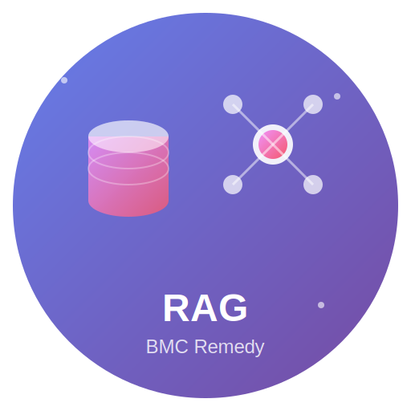

<p align="center">
  
</p>

<h1 align="center">BMC Remedy RAG Agent</h1>

<p align="center">
  <strong>Enterprise-Grade AI Assistant for BMC Remedy ITSM</strong>
</p>

<p align="center">
  <em>Transform years of IT support history into instant, context-aware answers — completely on-premise</em>
</p>

<p align="center">
  <a href="#features">Features</a> •
  <a href="#architecture">Architecture</a> •
  <a href="#quick-start">Quick Start</a> •
  <a href="#configuration">Configuration</a> •
  <a href="#api-reference">API Reference</a> •
  <a href="#deployment">Deployment</a>
</p>

<p align="center">
  
  
  
  
  
  
  
</p>

<p align="center">
  
  
  
</p>

---

## Overview

The **BMC Remedy RAG Agent** is a Retrieval-Augmented Generation (RAG) system purpose-built for enterprises running BMC Remedy AR System (versions 9.x through 20.x). It extracts ITSM data from your Remedy instance, creates semantic embeddings, and provides AI-powered search and chat capabilities — all running entirely within your infrastructure.

### The Problem

IT support teams accumulate decades of institutional knowledge locked inside:
- Incident resolutions buried in closed tickets
- Troubleshooting steps scattered across work logs
- Solutions hidden in PDF attachments and knowledge articles

Finding relevant information means manual searches, tribal knowledge, or starting from scratch.

### The Solution

This agent transforms your historical ITSM data into an intelligent knowledge base:

1. **Extracts** incidents, work logs, and attachments via native BMC Java API
2. **Vectorizes** content using local embeddings (no cloud required)
3. **Indexes** in PostgreSQL with pgvector for sub-second semantic search
4. **Generates** context-aware answers using local or cloud LLMs
5. **Cites** source tickets so agents can verify every response

---

## Features

### Core Capabilities

| Feature | Description |
|---------|-------------|
| **Semantic Search** | Find relevant tickets by meaning, not just keywords |
| **AI-Powered Chat** | Natural language Q&A with streaming responses |
| **Source Citations** | Every answer references specific incident numbers |
| **Incremental Sync** | CDC-based updates keep the knowledge base current |
| **ReBAC Security** | Users only see data from their authorized groups |

### Technical Highlights

| Capability | Implementation |
|------------|----------------|
| **100% Air-Gapped** | All components run on-premise with zero cloud dependencies |
| **Local Embeddings** | ONNX `all-minilm-l6-v2` model (384 dimensions) |
| **Local LLM** | Ollama with Llama 3 or Mistral — no API keys required |
| **Native BMC API** | Direct Java RPC integration (not REST) for maximum throughput |
| **Field ID Queries** | Immutable field IDs ensure stability across upgrades |
| **Thread-Safe** | ThreadLocal pattern for non-thread-safe ARServerUser |

---

## Architecture

```
┌─────────────────────────────────────────────────────────────────────────────┐
│                              USER INTERFACE                                  │
│                     React 19 • TypeScript • WebSocket                        │
└─────────────────────────────────────────────────────────────────────────────┘
                                      │
                                      ▼
┌─────────────────────────────────────────────────────────────────────────────┐
│                              API GATEWAY                                     │
│              REST Controllers • WebSocket Streaming • Health Checks          │
└─────────────────────────────────────────────────────────────────────────────┘
                                      │
                    ┌─────────────────┴─────────────────┐
                    ▼                                   ▼
┌─────────────────────────────────┐   ┌─────────────────────────────────────┐
│          RAG SERVICE            │   │       VECTORIZATION ENGINE          │
│  • LangChain4j Orchestration    │   │  • ONNX Embeddings (all-minilm)     │
│  • ReBAC Security Filtering     │   │  • Semantic Chunking Strategy       │
│  • Chat Memory (PostgreSQL)     │   │  • Apache Tika (attachments)        │
└─────────────────────────────────┘   └─────────────────────────────────────┘
                    │                                   │
                    └─────────────────┬─────────────────┘
                                      ▼
┌─────────────────────────────────────────────────────────────────────────────┐
│                      VECTOR STORE (PostgreSQL + pgvector)                    │
│              HNSW Indexing • JSONB Metadata • Cosine Similarity             │
└─────────────────────────────────────────────────────────────────────────────┘
                                      │
                                      ▼
┌─────────────────────────────────────────────────────────────────────────────┐
│                           REMEDY CONNECTOR                                   │
│        ThreadLocal Connection Pool • Field ID Queries • Pagination          │
└─────────────────────────────────────────────────────────────────────────────┘
                                      │
                                      ▼
┌─────────────────────────────────────────────────────────────────────────────┐
│                        BMC REMEDY AR SYSTEM                                  │
│            HPD:Help Desk • HPD:WorkLog • Knowledge Articles                 │
└─────────────────────────────────────────────────────────────────────────────┘
```

### Module Structure

| Module | Purpose |
|--------|---------|
| `remedy-connector` | Native BMC AR API integration with connection pooling |
| `vectorization-engine` | Local embedding generation and content chunking |
| `vector-store` | PostgreSQL + pgvector with Flyway migrations |
| `rag-service` | LangChain4j orchestration, ReBAC, and chat memory |
| `api-gateway` | REST/WebSocket APIs and Spring Boot bootstrap |
| `frontend/web-chat` | React 19 + TypeScript + Tailwind CSS interface |

---

## Quick Start

### Prerequisites

- **Java 17+** (OpenJDK or Eclipse Temurin)
- **Maven 3.9+**
- **PostgreSQL 16** with pgvector extension
- **Node.js 20+** (for frontend)
- **BMC AR System 9.x–20.x** with Java API access
- **Ollama** (recommended) or cloud LLM API

### Installation

#### 1. Clone the Repository

```bash
git clone https://github.com/your-org/bmc-remedy-rag-agent.git
cd bmc-remedy-rag-agent
```

#### 2. Install BMC AR API

```bash
mvn install:install-file \
  -Dfile=BMC/arAPI-91.9.jar \
  -DgroupId=com.bmc.arsys \
  -DartifactId=arAPI \
  -Dversion=91.9 \
  -Dpackaging=jar
```

#### 3. Configure Environment

```bash
cp .env.example .env
# Edit .env with your settings (see Configuration section)
```

#### 4. Start with Docker Compose

```bash
cd docker
docker-compose up -d
```

#### 5. Access the Application

| Service | URL |
|---------|-----|
| Web UI | http://localhost:5173 |
| API | http://localhost:8080 |
| Health Check | http://localhost:8080/api/v1/health |

---

## Configuration

### Environment Variables

Create a `.env` file with the following variables:

```bash
# ─────────────────────────────────────────────────────────────
# DATABASE
# ─────────────────────────────────────────────────────────────
POSTGRES_HOST=localhost
POSTGRES_PORT=5432
POSTGRES_DB=bmc_rag
POSTGRES_USER=raguser
POSTGRES_PASSWORD=your_secure_password

# ─────────────────────────────────────────────────────────────
# LLM CONFIGURATION (Choose ONE option)
# ─────────────────────────────────────────────────────────────

# Option A: Local LLM with Ollama (Recommended for air-gapped)
OLLAMA_BASE_URL=http://localhost:11434
OLLAMA_MODEL=llama3:8b

# Option B: Cloud LLM (if network access available)
# ZAI_API_KEY=your_api_key
# ZAI_BASE_URL=https://api.z.ai/api/paas/v4/
# ZAI_MODEL=glm-4.7

# ─────────────────────────────────────────────────────────────
# BMC REMEDY CONNECTION
# ─────────────────────────────────────────────────────────────
REMEDY_SERVER=remedy.example.com
REMEDY_PORT=7100
REMEDY_USERNAME=raguser
REMEDY_PASSWORD=your_remedy_password

# ─────────────────────────────────────────────────────────────
# RAG SETTINGS
# ─────────────────────────────────────────────────────────────
RAG_MAX_RESULTS=5
RAG_MIN_SCORE=0.7
RAG_REBAC_ENABLED=true
```

### Ollama Setup

For complete air-gapped operation, install Ollama:

**Linux/macOS:**
```bash
curl -fsSL https://ollama.com/install.sh | sh
ollama pull llama3:8b
```

**Docker:**
```bash
docker run -d -v ollama:/root/.ollama -p 11434:11434 --name ollama ollama/ollama
docker exec ollama ollama pull llama3:8b
```

**Recommended Models:**

| Model | Size | Use Case |
|-------|------|----------|
| `llama3:8b` | 4.7GB | Development, general use |
| `llama3:70b` | 40GB | Production, complex queries |
| `mistral:7b` | 4.1GB | Balanced performance |

---

## API Reference

### Chat Endpoints

#### Send Message

```http
POST /api/v1/chat
Content-Type: application/json

{
  "sessionId": "session-123",
  "question": "How do I reset VPN access?",
  "userGroups": ["IT Support", "Service Desk"]
}
```

**Response:**
```json
{
  "sessionId": "session-123",
  "response": "Based on historical tickets, here's how to reset VPN access:\n\n1. Navigate to the VPN self-service portal...\n\n(Source: INC000123456)",
  "sources": ["INC000123456", "KB0001234"],
  "hasContext": true
}
```

#### WebSocket Streaming

```javascript
const ws = new WebSocket('ws://localhost:8080/ws-chat');
ws.send(JSON.stringify({
  sessionId: 'session-123',
  question: 'How do I resolve printer issues?'
}));
```

### Search Endpoints

#### Semantic Search

```http
POST /api/v1/chat/search
Content-Type: application/json

{
  "query": "Exchange server email queue stuck",
  "maxResults": 5,
  "minScore": 0.7
}
```

### Ingestion Endpoints

| Endpoint | Method | Description |
|----------|--------|-------------|
| `/api/v1/ingest/incidents` | POST | Trigger full incident ingestion |
| `/api/v1/ingest/sync` | POST | Run incremental sync (CDC) |
| `/api/v1/ingest/status` | GET | Check ingestion status |

### Health Endpoints

| Endpoint | Description |
|----------|-------------|
| `/api/v1/health` | Application health status |
| `/api/v1/health/db` | Database connectivity |
| `/api/v1/health/remedy` | Remedy connection status |

---

## BMC Remedy Integration

### Critical Field IDs

The agent uses immutable Field IDs (not field names) for query stability:

| Field | Field ID | Purpose |
|-------|----------|---------|
| Incident Number | `1000000161` | Primary identifier, citation source |
| Summary | `1000000000` | Context injection for all chunks |
| Notes/Description | `1000000151` | Problem statement |
| Resolution | `1000000156` | High-value answer content |
| Status | `7` | Filter for Resolved/Closed tickets |
| Last Modified Date | `6` | CDC timestamp (Unix epoch) |
| Assigned Group | `1000000217` | ReBAC security filtering |

### Connection Best Practices

```java
// ✓ Use Field IDs (immutable across upgrades)
QualifierInfo qualifier = new QualifierInfo("'1000000156' != $NULL$");

// ✗ Avoid Field Names (can change with localization)
QualifierInfo qualifier = new QualifierInfo("'Resolution' != $NULL$");

// ✓ Dates as Unix epoch
QualifierInfo qualifier = new QualifierInfo("6 > " + lastSyncTimestamp);

// ✗ Never use date strings
QualifierInfo qualifier = new QualifierInfo("6 > '01/01/2024'");
```

---

## Deployment

### Docker Compose

```bash
cd docker
docker-compose up -d

# View logs
docker-compose logs -f rag-agent
```

### Kubernetes

```bash
kubectl create namespace bmc-rag
kubectl apply -f k8s/ -n bmc-rag
kubectl get pods -n bmc-rag
```

### Resource Requirements

| Component | RAM | CPU | Storage |
|-----------|-----|-----|---------|
| PostgreSQL + pgvector | 4GB | 2 cores | 50GB+ |
| Java Application | 8GB heap | 4 cores | 10GB |
| Ollama (optional) | 16GB+ | 8 cores | 50GB |

---

## Security

### Relationship-Based Access Control (ReBAC)

The agent enforces access control at the vector level:

1. **Ingestion**: Each chunk stores the source ticket's `Assigned Group`
2. **Query**: User's group memberships are passed with each request
3. **Filtering**: Vector search returns only authorized content

```java
// Example: User in "IT Support" group
// Can see: Tickets assigned to "IT Support"
// Cannot see: Tickets assigned to "HR", "Finance"
```

### Authentication

| Mode | Configuration |
|------|---------------|
| Development | `SECURITY_ENABLED=false` |
| Production | `SECURITY_ENABLED=true` with OAuth2/OIDC |

---

## Troubleshooting

### Common Errors

| Error | Cause | Solution |
|-------|-------|----------|
| `ARERR 93` | Server query timeout | Reduce `REMEDY_CHUNK_SIZE` to 250 |
| `ARERR 92` | Network RPC timeout | Increase `REMEDY_SOCKET_TIMEOUT` |
| `Connection refused` | BMC API jar missing | Run `mvn install:install-file` |
| `pgvector does not exist` | Extension not enabled | Run `CREATE EXTENSION vector;` |

### Logs

```bash
# Docker
docker-compose logs -f rag-agent

# Application
tail -f api-gateway/logs/application.log
```

---

## Development

### Build

```bash
# Full build with tests
mvn clean install

# Skip tests
mvn clean package -DskipTests

# Single module
mvn clean package -pl rag-service -am
```

### Run Locally

```bash
./start-dev.sh
```

### Frontend Development

```bash
cd frontend/web-chat
npm install
npm run dev
```

---

## Project Structure

```
bmc-remedy-rag-agent/
├── api-gateway/           # REST/WebSocket endpoints
├── rag-service/           # LangChain4j orchestration
├── remedy-connector/      # BMC AR API integration
├── vector-store/          # PostgreSQL + pgvector
├── vectorization-engine/  # Embeddings and chunking
├── frontend/web-chat/     # React UI
├── docker/                # Docker Compose setup
├── docs/                  # Additional documentation
└── pom.xml                # Parent POM (Maven)
```

---

## Documentation

| Document | Description |
|----------|-------------|
| [DOCUMENTATION.md](DOCUMENTATION.md) | Complete technical documentation |
| [docs/API.md](docs/API.md) | API reference and examples |
| [docs/DEVELOPMENT.md](docs/DEVELOPMENT.md) | Development guide |

---

## License

Proprietary — Copyright 2025. All rights reserved.

---

## Acknowledgments

- **[LangChain4j](https://github.com/langchain4j/langchain4j)** — Java LLM orchestration framework
- **[pgvector](https://github.com/pgvector/pgvector)** — PostgreSQL vector similarity search
- **[Ollama](https://ollama.com)** — Local LLM runtime
- **[Apache Tika](https://tika.apache.org)** — Document content extraction
- **BMC Software** — AR System Java API
