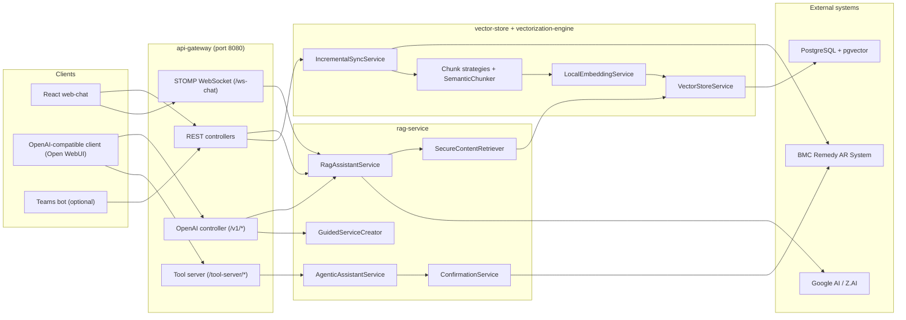
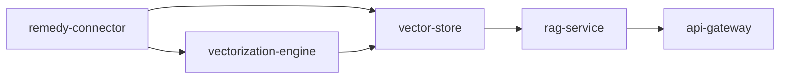
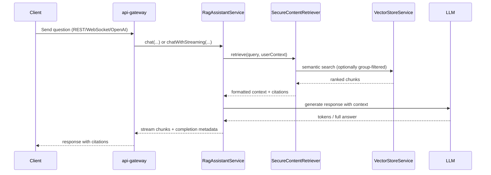
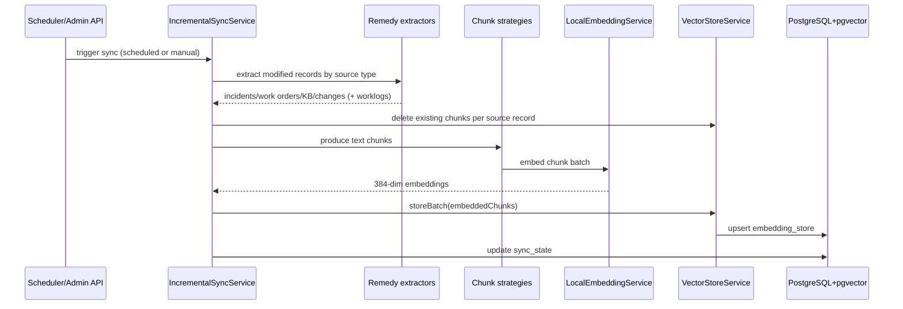
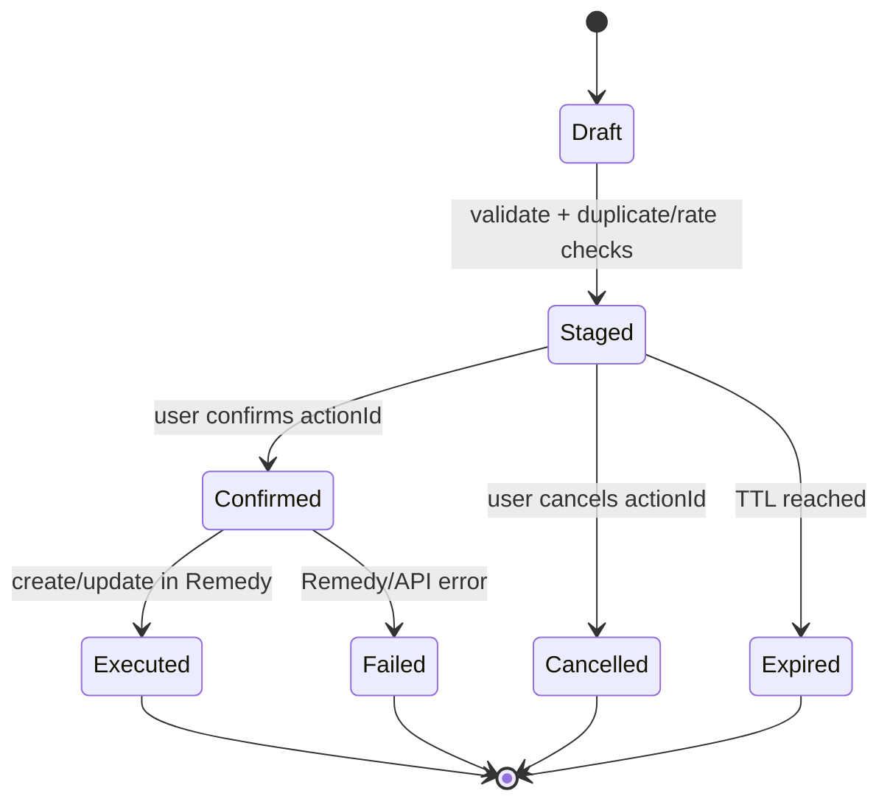

# BMC Remedy RAG Agent

Enterprise RAG + agentic assistant for BMC Remedy ITSM.

This repository contains a multi-module Spring Boot system that:
- extracts Remedy ITSM records with the native AR Java API,
- chunks and embeds content locally (ONNX `all-minilm-l6-v2`, 384-dim),
- stores vectors in PostgreSQL + pgvector,
- serves chat/search APIs (REST, WebSocket, OpenAI-compatible), and
- supports staged incident/work-order operations with explicit confirmation.

## Table of Contents
- [What It Does](#what-it-does)
- [Code-Validated Architecture](#code-validated-architecture)
- [Main Request Flows](#main-request-flows)
- [Modules](#modules)
- [Quick Start](#quick-start)
- [Configuration](#configuration)
- [API Surface](#api-surface)
- [Data Model](#data-model)
- [Operations and Troubleshooting](#operations-and-troubleshooting)

## What It Does

### Core capabilities
- Semantic retrieval over Incidents, Work Orders, Knowledge Articles, and Change Requests.
- Streaming chat responses with citations.
- ReBAC-aware retrieval via `assigned_group` metadata.
- Incremental sync (scheduled + admin-triggered).
- Agentic flows for create/update actions with staging, confirm/cancel, and audit trail.
- OpenAI-compatible chat endpoint for Open WebUI and similar clients.
- Guided Damee service-request flow (service intent matching + field collection).

### LLM/provider behavior in current code
- Default runtime config enables **Google AI** (`google-ai.enabled: true`).
- Z.AI config exists but is disabled by default (`zai.enabled: false`).
- Ollama config class exists but is currently commented/disabled in code.

## Code-Validated Architecture

### Runtime topology



### Module dependency map



## Main Request Flows

### 1) Chat + retrieval + streaming



### 2) Ingestion/sync pipeline



### 3) Agentic confirmation lifecycle



## Modules

| Module | Responsibility | Key classes |
|---|---|---|
| `api-gateway` | Unified HTTP/WebSocket/OpenAI entrypoint | `ChatController`, `WebSocketChatController`, `OpenAiCompatibleController`, `ToolServerController`, `IngestionController` |
| `rag-service` | Retrieval orchestration, memory, prompting, agentic logic | `RagAssistantService`, `SecureContentRetriever`, `AgenticAssistantService`, `ConfirmationService`, `GuidedServiceCreator` |
| `vector-store` | Vector persistence/search + sync orchestration | `VectorStoreService`, `IncrementalSyncService`, `EmbeddingRepository` |
| `vectorization-engine` | Chunking + embedding | `SemanticChunker`, source chunk strategies, `LocalEmbeddingService` |
| `remedy-connector` | Native BMC AR extraction and write operations | extractors, `IncidentCreator`, `IncidentUpdater`, `WorkOrderCreator`, `ThreadLocalARContext` |
| `frontend/web-chat` | React STOMP chat UI | `useWebSocket`, chat components, providers |
| `open-webui-tools` | Python tool wrappers for Open WebUI | `bmc_remedy_incidents.py`, `bmc_knowledge_search.py`, `it_support_agent_pipe.py` |

## Quick Start

### Prerequisites
- Java 17+
- Maven 3.9+
- PostgreSQL 16+ with `pgvector`
- Node.js 20+ (if running `frontend/web-chat`)
- BMC AR Java API JAR (`arAPI-91.9.jar`) available locally

### 1) Install BMC AR Java API into local Maven

```bash
mvn install:install-file \
  -Dfile=BMC/arAPI-91.9.jar \
  -DgroupId=com.bmc.arsys \
  -DartifactId=arAPI \
  -Dversion=91.9 \
  -Dpackaging=jar
```

### 2) Build

```bash
./mvnw clean package -DskipTests
```

### 3) Run backend locally

```bash
java -jar api-gateway/target/api-gateway-1.0.0-SNAPSHOT.jar --spring.profiles.active=dev
```

Backend URLs:
- Health: `http://localhost:8080/api/v1/health`
- REST chat: `http://localhost:8080/api/v1/chat`
- OpenAI-compatible: `http://localhost:8080/v1/chat/completions`

### 4) (Optional) run React web chat

```bash
cd frontend/web-chat
npm install
npm run dev
```

### 5) Docker Compose path

```bash
cd docker
docker compose up -d
```

Compose starts:
- `postgres` (`pgvector/pgvector:pg16`)
- `rag-agent` (Spring Boot app)

## Configuration

`api-gateway/src/main/resources/application.yml` is the source of truth.

### High-impact settings

| Area | Key properties/env |
|---|---|
| Database | `POSTGRES_HOST`, `POSTGRES_PORT`, `POSTGRES_DB`, `POSTGRES_USER`, `POSTGRES_PASSWORD` |
| Remedy connector | `REMEDY_ENABLED`, `REMEDY_SERVER`, `REMEDY_PORT`, `REMEDY_USERNAME`, `REMEDY_PASSWORD` |
| LLM provider | `google-ai.*` (default enabled), `zai.*` (optional), `GOOGLE_AI_API_KEY`, `ZAI_API_KEY` |
| Retrieval | `RAG_MAX_RESULTS`, `RAG_MIN_SCORE`, `RAG_REBAC_ENABLED` |
| Sync | `SYNC_INTERVAL` |
| Agentic ops | `AGENTIC_ENABLED`, `AGENTIC_CONFIRMATION_TIMEOUT`, `AGENTIC_MAX_CREATIONS` |
| Security | `SECURITY_ENABLED`, `JWT_JWK_SET_URI` |

### Provider selection behavior
- To use Google AI (default): keep `google-ai.enabled=true` and set `GOOGLE_AI_API_KEY`.
- To use Z.AI: set `zai.enabled=true`, set `google-ai.enabled=false`, and provide `ZAI_API_KEY`.

### Security modes
- `dev` profile sets `security.enabled=false`.
- When enabled, OAuth2 resource server expects JWT/JWKS config.

## API Surface

### Chat and retrieval
| Endpoint | Method | Purpose |
|---|---|---|
| `/api/v1/chat` | POST | Main chat endpoint |
| `/api/v1/chat/search` | POST | Retrieval-only semantic search |
| `/api/v1/chat/sessions` | GET | Session summaries |
| `/api/v1/chat/sessions/{sessionId}` | DELETE | Clear session |
| `/api/v1/chat/sessions/{sessionId}/history` | GET | Session history |

### WebSocket
- STOMP endpoint: `/ws-chat`
- Send destination: `/app/chat.query`
- Receive destination: `/user/queue/response`

### OpenAI-compatible
| Endpoint | Method |
|---|---|
| `/v1/chat/completions` | POST |
| `/v1/models` | GET |
| `/v1/models/{modelId}` | GET |

### Ingestion/admin
| Endpoint | Method | Purpose |
|---|---|---|
| `/api/v1/admin/ingestion/trigger` | POST | Trigger sync/full-sync |
| `/api/v1/admin/ingestion/status` | GET | Sync status |
| `/api/v1/admin/ingestion/statistics` | GET | Embedding counts |
| `/api/v1/admin/ingestion/embeddings/{sourceType}` | DELETE | Clear source embeddings |

### Agentic + tool server (when `agentic.enabled=true`)
| Endpoint group | Purpose |
|---|---|
| `/api/v1/actions/*` | Confirm/cancel/list pending staged actions |
| `/tool-server/openapi.json` | OpenAPI spec for tool discovery |
| `/tool-server/incidents/*` | Search/details/create/update/worklogs |
| `/tool-server/knowledge/*` | Search/details |
| `/tool-server/workorders/search` | Work order semantic search |
| `/tool-server/actions/*` | Tool-oriented confirm/cancel/pending |

## Data Model

Primary tables created/evolved by Flyway migrations in `vector-store/src/main/resources/db/migration`:

| Table | Purpose |
|---|---|
| `embedding_store` | Vectorized chunks + metadata + source mapping |
| `sync_state` | Last sync timestamp/status per source type |
| `chat_memory` | Session memory persistence |
| `chat_history` | OpenAI-style role history |
| `feedback` | User feedback on model responses |
| `action_audit` | Agentic operation audit trail |
| `vector_search_config` | HNSW runtime config (e.g., `ef_search`) |

Search/index highlights:
- `vector(384)` embeddings with HNSW index.
- JSONB metadata filters (`assigned_group` for ReBAC).
- Full-text columns/functions for hybrid and Arabic search capabilities.

## Operations and Troubleshooting

### Health and metrics
- Health: `/api/v1/health`, `/api/v1/ready`, `/api/v1/live`
- RAG metrics: `/api/v1/metrics/rag` and `/api/v1/metrics/rag/*`

### Common pitfalls
- `REMEDY_ENABLED` defaults to `false`; ingestion from Remedy will be skipped until enabled.
- Root `start-all.sh` is environment-specific (hardcoded paths and local assumptions); prefer explicit commands above.
- If security is enabled without JWT configuration, startup will fail in `SecurityConfig`.
- If `pgvector` extension is missing, vector queries will fail.

### Useful commands

```bash
# Build all modules
./mvnw clean package -DskipTests

# Run tests
./mvnw test

# Check backend health
curl -s http://localhost:8080/api/v1/health

# Tail docker logs
cd docker && docker compose logs -f rag-agent
```

---

For deeper module-level details, inspect:
- `api-gateway/src/main/resources/application.yml`
- `vector-store/src/main/resources/db/migration`
- `open-webui-tools/README.md`
