<h1 align="center">BMC Remedy RAG Agent</h1>

<p align="center">
  <strong>Enterprise-Grade AI Assistant for BMC Remedy ITSM</strong>
</p>

<p align="center">
  <em>Transform years of IT support history into instant, context-aware answers — completely on-premise</em>
</p>

<p align="center">
  <a href="#features">Features</a> •
  <a href="#architecture">Architecture</a> •
  <a href="#quick-start">Quick Start</a> •
  <a href="#configuration">Configuration</a> •
  <a href="#api-reference">API Reference</a> •
  <a href="#agentic-operations">Agentic Operations</a> •
  <a href="#deployment">Deployment</a>
</p>

<p align="center">
  
  
  
  
  
  
  
</p>

<p align="center">
  
  
  
  
</p>

---

## Overview

The **BMC Remedy RAG Agent** is a Retrieval-Augmented Generation (RAG) system purpose-built for enterprises running BMC Remedy AR System (versions 9.x through 20.x). It extracts ITSM data from your Remedy instance, creates semantic embeddings, and provides AI-powered search and chat capabilities — all running entirely within your infrastructure.

### The Problem

IT support teams accumulate decades of institutional knowledge locked inside:
- Incident resolutions buried in closed tickets
- Troubleshooting steps scattered across work logs
- Solutions hidden in PDF attachments and knowledge articles

Finding relevant information means manual searches, tribal knowledge, or starting from scratch.

### The Solution

This agent transforms your historical ITSM data into an intelligent knowledge base:

1. **Extracts** incidents, work logs, and attachments via native BMC Java API
2. **Vectorizes** content using local embeddings (no cloud required)
3. **Indexes** in PostgreSQL with pgvector for sub-second semantic search
4. **Generates** context-aware answers using local or cloud LLMs
5. **Cites** source tickets so agents can verify every response
6. **Creates** incidents and work orders via agentic AI with confirmation workflow

---

## Features

### Core Capabilities

| Feature | Description |
|---------|-------------|
| **Semantic Search** | Find relevant tickets by meaning, not just keywords |
| **AI-Powered Chat** | Natural language Q&A with streaming responses |
| **Source Citations** | Every answer references specific incident numbers |
| **Incremental Sync** | CDC-based updates keep the knowledge base current |
| **ReBAC Security** | Users only see data from their authorized groups |
| **Agentic Operations** | Create incidents and work orders via AI with confirmation workflow |
| **Hybrid Search** | Combines vector similarity + full-text search via RRF |
| **Bilingual Support** | English and Arabic interfaces with RTL support |

### Technical Highlights

| Capability | Implementation |
|------------|----------------|
| **100% Air-Gapped** | All components run on-premise with zero cloud dependencies |
| **Local Embeddings** | ONNX `all-minilm-l6-v2` model (384 dimensions) |
| **Flexible LLM** | Ollama (local) or Z.AI cloud with custom streaming handler |
| **Native BMC API** | Direct Java RPC integration (not REST) for maximum throughput |
| **Field ID Queries** | Immutable field IDs ensure stability across upgrades |
| **Thread-Safe** | ThreadLocal pattern for non-thread-safe ARServerUser |
| **Synchronized Streaming** | Token-level locking prevents race conditions in responses |
| **HNSW Indexing** | Fast approximate nearest neighbor search (m=24, ef_construction=200) |
| **Duplicate Detection** | Semantic similarity check before creating incidents |

---

## Architecture

### System Overview

```mermaid
%%{init: {'theme': 'base', 'themeVariables': { 'primaryColor': '#4F46E5', 'primaryTextColor': '#fff'}}}%%
graph TB
    subgraph UI["🖥️ User Interface"]
        Web["React 19 Web Chat<br/>TypeScript • Tailwind CSS<br/>English/Arabic • Dark/Light"]
    end

    subgraph Gateway["🚪 API Gateway (Port 8080)"]
        REST["REST Controllers"]
        WS["WebSocket Streaming"]
        Tools["Tool Server"]
        OpenAI["OpenAI-Compatible API"]
        Security["OAuth2/JWT • Rate Limiting"]
    end

    subgraph Services["⚙️ Core Services"]
        direction LR
        RAG["RAG Service<br/>LangChain4j • ReBAC<br/>Chat Memory • Agentic Tools"]
        VEC["Vectorization Engine<br/>ONNX Embeddings<br/>Semantic Chunking"]
    end

    subgraph Storage["💾 Storage Layer"]
        VS["Vector Store<br/>PostgreSQL + pgvector<br/>HNSW • Hybrid Search"]
    end

    subgraph Data["📋 Data Sources"]
        RC["Remedy Connector<br/>ThreadLocal Pool<br/>Field ID Queries"]
        BMC["BMC Remedy AR System<br/>9.x - 20.x"]
        LLM["LLM Engine<br/>Ollama / Z.AI"]
    end

    UI --> Gateway
    REST --> RAG
    WS --> RAG
    Tools --> RAG
    OpenAI --> RAG

    RAG --> VEC
    RAG --> VS
    RAG --> LLM
    VEC --> VS

    VS --> RC
    RC --> BMC

    classDef ui fill:#DBEAFE,stroke:#3B82F6,stroke-width:2px
    classDef gateway fill:#FEF3C7,stroke:#F59E0B,stroke-width:2px
    classDef services fill:#D1FAE5,stroke:#10B981,stroke-width:2px
    classDef storage fill:#F3E8FF,stroke:#8B5CF6,stroke-width:2px
    classDef data fill:#FEE2E2,stroke:#EF4444,stroke-width:2px

    class Web ui
    class REST,WS,Tools,OpenAI,Security gateway
    class RAG,VEC services
    class VS storage
    class RC,BMC,LLM data
```



### Request Flow

```mermaid
sequenceDiagram
    autonumber
    participant U as 👤 User
    participant W as 🌐 Web Chat
    participant A as 🚪 API Gateway
    participant R as 🧠 RAG Service
    participant V as 📊 Vector Store
    participant L as 🤖 LLM

    U->>W: Ask question
    W->>A: HTTP/WebSocket
    A->>R: chat(sessionId, question)
    R->>V: similaritySearch()
    V-->>R: Relevant chunks
    R->>L: generate(context + question)
    L-->>R: Stream tokens
    R-->>A: Stream response
    A-->>W: WebSocket stream
    W-->>U: Display answer with citations
```



### Text Diagram (Fallback)

```
┌─────────────────────────────────────────────────────────────────────────────┐
│                              USER INTERFACE                                  │
│           React 19 • TypeScript • WebSocket • Tailwind CSS                   │
│                    English/Arabic • Dark/Light Theme                         │
└─────────────────────────────────────────────────────────────────────────────┘
                                      │
                                      ▼
┌─────────────────────────────────────────────────────────────────────────────┐
│                              API GATEWAY (Port 8080)                         │
│  REST Controllers • WebSocket Streaming • Tool Server • OpenAI-Compatible   │
│     Rate Limiting (Resilience4j + Bucket4j) • OAuth2/JWT Security           │
└─────────────────────────────────────────────────────────────────────────────┘
                                      │
                    ┌─────────────────┴─────────────────┐
                    ▼                                   ▼
┌─────────────────────────────────┐   ┌─────────────────────────────────────┐
│          RAG SERVICE            │   │       VECTORIZATION ENGINE          │
│  • LangChain4j Orchestration    │   │  • ONNX Embeddings (all-minilm)     │
│  • ReBAC Security Filtering     │   │  • Semantic Chunking Strategy       │
│  • Chat Memory (PostgreSQL)     │   │  • Apache Tika (PDF/Word/Excel)     │
│  • Agentic Tools (@Tool)        │   │  • Query Rewriting & Expansion      │
│  • Confirmation Service         │   │  • Context Injection                │
└─────────────────────────────────┘   └─────────────────────────────────────┘
                    │                                   │
                    └─────────────────┬─────────────────┘
                                      ▼
┌─────────────────────────────────────────────────────────────────────────────┐
│                      VECTOR STORE (PostgreSQL + pgvector)                    │
│     HNSW Indexing • Hybrid Search (RRF) • JSONB Metadata • Flyway           │
│              Cosine Similarity • Full-Text Search • Action Audit            │
└─────────────────────────────────────────────────────────────────────────────┘
                                      │
                                      ▼
┌─────────────────────────────────────────────────────────────────────────────┐
│                           REMEDY CONNECTOR                                   │
│    ThreadLocal Connection Pool • Field ID Queries • Batch Pagination        │
│      Incident Creator/Updater • Work Log Service • User Service             │
└─────────────────────────────────────────────────────────────────────────────┘
                                      │
                                      ▼
┌─────────────────────────────────────────────────────────────────────────────┐
│                        BMC REMEDY AR SYSTEM (9.x - 20.x)                     │
│  HPD:Help Desk • HPD:WorkLog • WOI:WorkOrder • CHG:Infrastructure Change    │
│                       RKM:KnowledgeArticleManager                            │
└─────────────────────────────────────────────────────────────────────────────┘
```

### Module Structure

| Module | Purpose | Key Components |
|--------|---------|----------------|
| `remedy-connector` | Native BMC AR API integration | ThreadLocalARContext, IncidentCreator, WorkLogService |
| `vectorization-engine` | Local embedding generation and content chunking | LocalEmbeddingService, SemanticChunker, AttachmentParser |
| `vector-store` | PostgreSQL + pgvector with Flyway migrations | VectorStoreService, HybridSearchService, IncrementalSyncService |
| `rag-service` | LangChain4j orchestration, ReBAC, and chat memory | RagAssistantService, ConfirmationService, AgenticRateLimiter |
| `api-gateway` | REST/WebSocket APIs and Spring Boot bootstrap | ChatController, ToolServerController, OpenAiCompatibleController |
| `frontend/web-chat` | React 19 + TypeScript + Tailwind CSS interface | Chat, Citations, ServiceCatalog, i18n |

---

## Quick Start

### Prerequisites

- **Java 17+** (OpenJDK or Eclipse Temurin)
- **Maven 3.9+**
- **PostgreSQL 16** with pgvector extension
- **Node.js 20+** (for frontend)
- **BMC AR System 9.x–20.x** with Java API access
- **Ollama** (recommended) or Z.AI API key

### Installation

#### 1. Clone the Repository

```bash
git clone https://github.com/your-org/bmc-remedy-rag-agent.git
cd bmc-remedy-rag-agent
```

#### 2. Install BMC AR API

```bash
mvn install:install-file \
  -Dfile=BMC/arAPI-91.9.jar \
  -DgroupId=com.bmc.arsys \
  -DartifactId=arAPI \
  -Dversion=91.9 \
  -Dpackaging=jar
```

#### 3. Configure Environment

```bash
cp .env.example .env
# Edit .env with your settings (see Configuration section)
```

#### 4. Start with Docker Compose

```bash
cd docker
docker-compose up -d
```

#### 5. Access the Application

| Service | URL |
|---------|-----|
| Web UI | http://localhost:5173 |
| API | http://localhost:8080 |
| Health Check | http://localhost:8080/api/v1/health |
| OpenAI-Compatible | http://localhost:8080/v1/chat/completions |

---

## Configuration

### Environment Variables

Create a `.env` file with the following variables:

```bash
# ─────────────────────────────────────────────────────────────
# DATABASE
# ─────────────────────────────────────────────────────────────
POSTGRES_HOST=localhost
POSTGRES_PORT=5432
POSTGRES_DB=bmc_rag
POSTGRES_USER=raguser
POSTGRES_PASSWORD=your_secure_password

# ─────────────────────────────────────────────────────────────
# LLM CONFIGURATION (Choose ONE option)
# ─────────────────────────────────────────────────────────────

# Option A: Local LLM with Ollama (Recommended for air-gapped)
OLLAMA_BASE_URL=http://localhost:11434
OLLAMA_MODEL=llama3:8b

# Option B: Z.AI Cloud LLM (GLM models)
# ZAI_API_KEY=your_api_key
# ZAI_BASE_URL=https://api.z.ai/api/paas/v4/
# ZAI_MODEL=glm-4.5-flash
# ZAI_THINKING_ENABLED=false  # Set to true for GLM-4.7 reasoning mode

# ─────────────────────────────────────────────────────────────
# BMC REMEDY CONNECTION
# ─────────────────────────────────────────────────────────────
REMEDY_SERVER=remedy.example.com
REMEDY_PORT=7100
REMEDY_USERNAME=raguser
REMEDY_PASSWORD=your_remedy_password
REMEDY_SOCKET_TIMEOUT=60000
REMEDY_CHUNK_SIZE=500

# ─────────────────────────────────────────────────────────────
# RAG SETTINGS
# ─────────────────────────────────────────────────────────────
RAG_MAX_RESULTS=5
RAG_MIN_SCORE=0.3
RAG_REBAC_ENABLED=true
RAG_MAX_MEMORY_MESSAGES=20

# ─────────────────────────────────────────────────────────────
# AGENTIC OPERATIONS
# ─────────────────────────────────────────────────────────────
AGENTIC_ENABLED=true
AGENTIC_CONFIRMATION_TIMEOUT=5
AGENTIC_MAX_CREATIONS_PER_HOUR=10
AGENTIC_DUPLICATE_THRESHOLD=0.85

# ─────────────────────────────────────────────────────────────
# SECURITY
# ─────────────────────────────────────────────────────────────
SECURITY_ENABLED=false  # Set to true for production
JWT_JWK_SET_URI=your_jwks_endpoint
```

### Ollama Setup

For complete air-gapped operation, install Ollama:

**Linux/macOS:**
```bash
curl -fsSL https://ollama.com/install.sh | sh
ollama pull llama3:8b
```

**Docker:**
```bash
docker run -d -v ollama:/root/.ollama -p 11434:11434 --name ollama ollama/ollama
docker exec ollama ollama pull llama3:8b
```

**Recommended Models:**

| Model | Size | Use Case |
|-------|------|----------|
| `llama3:8b` | 4.7GB | Development, general use |
| `llama3:70b` | 40GB | Production, complex queries |
| `mistral:7b` | 4.1GB | Balanced performance |

---

## API Reference

### Chat Endpoints

#### Send Message

```http
POST /api/v1/chat
Content-Type: application/json

{
  "sessionId": "session-123",
  "question": "How do I reset VPN access?",
  "userGroups": ["IT Support", "Service Desk"],
  "sourceTypes": ["Incident", "KnowledgeArticle"]
}
```

**Response:**
```json
{
  "sessionId": "session-123",
  "response": "Based on historical tickets, here's how to reset VPN access:\n\n1. Navigate to the VPN self-service portal...\n\n(Source: INC000123456)",
  "sources": ["INC000123456", "KB0001234"],
  "hasContext": true,
  "timestamp": 1705484800000
}
```

#### WebSocket Streaming

```javascript
const ws = new WebSocket('ws://localhost:8080/ws-chat');
ws.send(JSON.stringify({
  sessionId: 'session-123',
  question: 'How do I resolve printer issues?'
}));

// Receive streaming tokens
ws.onmessage = (event) => {
  const chunk = JSON.parse(event.data);
  // chunk.type: THINKING | TOKEN | COMPLETE | ERROR
  // chunk.content: token text or final response
  // chunk.sources: array of source IDs (on COMPLETE)
};
```

### Search Endpoints

#### Semantic Search

```http
POST /api/v1/chat/search
Content-Type: application/json

{
  "query": "Exchange server email queue stuck",
  "maxResults": 5,
  "minScore": 0.7
}
```

### OpenAI-Compatible API

For integration with Open WebUI and other tools:

```http
POST /v1/chat/completions
Content-Type: application/json

{
  "model": "bmc-remedy-rag",
  "messages": [
    {"role": "user", "content": "How do I reset a password?"}
  ],
  "stream": true
}
```

### Health Endpoints

| Endpoint | Description |
|----------|-------------|
| `GET /api/v1/health` | Application health status |
| `GET /api/v1/ready` | Kubernetes readiness probe |
| `GET /api/v1/live` | Kubernetes liveness probe |

---

## Agentic Operations

The agent can create and update incidents directly in BMC Remedy with a mandatory confirmation workflow.

### Confirmation Workflow Diagram


### Available Tools

| Tool | Method | Description |
|------|--------|-------------|
| **RemedyIncidentTool** | `searchSimilarIncidents` | Find duplicate incidents before creation |
| **RemedyIncidentTool** | `stageIncidentCreation` | Stage a new incident for user confirmation |
| **RemedyWorkOrderTool** | `stageWorkOrderCreation` | Stage a new work order |

### Confirmation Workflow Steps

1. **User Request**: "Create an incident for VPN timeout issues"
2. **Duplicate Check**: Agent searches for similar existing incidents
3. **Staging**: If unique, creates pending action with 5-minute expiry
4. **Confirmation Prompt**: Returns actionId for user to confirm
5. **Execution**: On `confirm {actionId}`, creates in Remedy
6. **Audit**: All actions logged for compliance

### Tool Server Endpoints

```http
# Search incidents
POST /tool-server/incidents/search
{
  "query": "VPN connection timeout",
  "limit": 5,
  "minScore": 0.3
}

# Create incident (staged)
POST /tool-server/incidents
{
  "summary": "VPN connection timeout",
  "description": "Users experiencing timeout...",
  "impact": 3,
  "urgency": 2
}

# Confirm action
POST /tool-server/actions/confirm
{
  "actionId": "abc12345",
  "sessionId": "session-123"
}
```

### Rate Limiting

| Limiter | Rate | Scope |
|---------|------|-------|
| Chat | 100/min | Per-instance |
| Search | 200/min | Per-instance |
| Actions | 10/hour | Per-user |

---

## BMC Remedy Integration

### Critical Field IDs

The agent uses immutable Field IDs (not field names) for query stability:

| Field | Field ID | Purpose |
|-------|----------|---------|
| Incident Number | `1000000161` | Primary identifier, citation source |
| Summary | `1000000000` | Context injection for all chunks |
| Notes/Description | `1000000151` | Problem statement |
| Resolution | `1000000156` | High-value answer content |
| Status | `7` | Filter for Resolved/Closed tickets |
| Last Modified Date | `6` | CDC timestamp (Unix epoch) |
| Assigned Group | `1000000217` | ReBAC security filtering |
| Impact | `1000000163` | Incident impact (1-4) |
| Urgency | `1000000162` | Incident urgency (1-4) |

### Connection Best Practices

```java
// ✓ Use Field IDs (immutable across upgrades)
QualifierInfo qualifier = new QualifierInfo("'1000000156' != $NULL$");

// ✗ Avoid Field Names (can change with localization)
QualifierInfo qualifier = new QualifierInfo("'Resolution' != $NULL$");

// ✓ Dates as Unix epoch
QualifierInfo qualifier = new QualifierInfo("6 > " + lastSyncTimestamp);

// ✗ Never use date strings
QualifierInfo qualifier = new QualifierInfo("6 > '01/01/2024'");
```

---

## Security

### Relationship-Based Access Control (ReBAC)

The agent enforces access control at the vector level:

1. **Ingestion**: Each chunk stores the source ticket's `Assigned Group`
2. **Query**: User's group memberships are passed with each request
3. **Filtering**: Vector search returns only authorized content

```java
// Example: User in "IT Support" group
// Can see: Tickets assigned to "IT Support"
// Cannot see: Tickets assigned to "HR", "Finance"
```

### Input Validation

The agent protects against prompt injection and other attacks:

- Regex patterns detect override attempts
- Field length validation (Summary: 255, Description: 32000)
- HTML stripping and content sanitization
- Delimiter injection detection

### Authentication

| Mode | Configuration |
|------|---------------|
| Development | `SECURITY_ENABLED=false` |
| Production | `SECURITY_ENABLED=true` with OAuth2/OIDC |

---

## Deployment

### Docker Compose

```bash
cd docker
docker-compose up -d

# View logs
docker-compose logs -f rag-agent
```

### Kubernetes

```bash
kubectl create namespace bmc-rag
kubectl apply -f k8s/ -n bmc-rag
kubectl get pods -n bmc-rag
```

### Resource Requirements

| Component | RAM | CPU | Storage |
|-----------|-----|-----|---------|
| PostgreSQL + pgvector | 4GB | 2 cores | 50GB+ |
| Java Application | 8GB heap | 4 cores | 10GB |
| Ollama (optional) | 16GB+ | 8 cores | 50GB |

---

## Troubleshooting

### Common Errors

| Error | Cause | Solution |
|-------|-------|----------|
| `ARERR 93` | Server query timeout | Reduce `REMEDY_CHUNK_SIZE` to 250 |
| `ARERR 92` | Network RPC timeout | Increase `REMEDY_SOCKET_TIMEOUT` |
| `Connection refused` | BMC API jar missing | Run `mvn install:install-file` |
| `pgvector does not exist` | Extension not enabled | Run `CREATE EXTENSION vector;` |
| Scrambled text in streaming | Token ordering race condition | Fixed in v1.1 - tokens now synchronized |
| `response cannot be null` | Z.AI reasoning_content issue | Fixed in v1.1 - custom streaming model |
| `429 Rate Limit` | Z.AI API concurrency limit | Reduce concurrent requests or contact Z.AI |
| `ARERR 9251/9252` | Connection pool issues | Retry with delay (auto-handled) |

### Logs

```bash
# Docker
docker-compose logs -f rag-agent

# Application
tail -f api-gateway/logs/application.log
```

---

## Development

### Build

```bash
# Full build with tests
mvn clean install

# Skip tests
mvn clean package -DskipTests

# Single module
mvn clean package -pl rag-service -am
```

### Run Locally

```bash
# Using script
./start-dev.sh

# Or use start-all.sh / stop-all.sh
./start-all.sh
./stop-all.sh
```

### Frontend Development

```bash
cd frontend/web-chat
npm install
npm run dev
```

---

## Project Structure

```
bmc-remedy-rag-agent/
├── api-gateway/                 # REST/WebSocket endpoints
│   ├── src/main/java/.../controller/  # Controllers
│   ├── src/main/java/.../config/      # Security, CORS, WebSocket
│   └── src/main/resources/            # application.yml, static/
├── rag-service/                 # LangChain4j orchestration
│   ├── src/main/java/.../service/     # RagAssistantService
│   ├── src/main/java/.../tools/       # RemedyIncidentTool, etc.
│   ├── src/main/java/.../security/    # ReBAC, InputValidator
│   └── src/main/java/.../confirmation/ # Agentic confirmation
├── remedy-connector/            # BMC AR API integration
│   ├── src/main/java/.../connection/  # ThreadLocalARContext
│   ├── src/main/java/.../creator/     # IncidentCreator, IncidentUpdater
│   ├── src/main/java/.../service/     # WorkLogService, RemedyUserService
│   └── src/main/java/.../util/        # FieldIdConstants
├── vector-store/                # PostgreSQL + pgvector
│   ├── src/main/java/.../service/     # VectorStoreService, HybridSearchService
│   └── src/main/resources/db/migration/ # V1-V10 Flyway migrations
├── vectorization-engine/        # Embeddings and chunking
│   ├── src/main/java/.../embedding/   # LocalEmbeddingService
│   ├── src/main/java/.../chunking/    # SemanticChunker, *ChunkStrategy
│   └── src/main/java/.../tika/        # AttachmentParser
├── frontend/web-chat/           # React 19 UI
│   ├── src/components/          # Chat, Messages, Citations
│   └── src/providers/           # ChatProvider, LanguageProvider
├── docker/                      # Docker Compose setup
├── docs/                        # Additional documentation
├── BMC/                         # BMC AR API jar
└── pom.xml                      # Parent POM (Maven)
```

---

## Documentation

| Document | Description |
|----------|-------------|
| [DOCUMENTATION.md](DOCUMENTATION.md) | Complete technical documentation |
| [QUICK_REFERENCE.md](QUICK_REFERENCE.md) | Quick reference guide |

---

## Changelog

### v1.2.0 (January 2026)

#### New Features

- **Agentic Operations**: Create and update incidents via AI with confirmation workflow
- **Tool Server**: OpenAI-compatible endpoints for Open WebUI integration
- **Hybrid Search**: Combined vector + full-text search using Reciprocal Rank Fusion (RRF)
- **Duplicate Detection**: Semantic similarity check before incident creation
- **Action Audit**: Full audit trail for agentic operations

#### Enhancements

- HNSW index tuning (m=24, ef_construction=200) for 1M+ embeddings
- Query rewriting with typo correction and abbreviation expansion
- Per-user rate limiting with Bucket4j
- Enhanced chat memory retention scheduling

### v1.1.0 (January 2026)

#### Bug Fixes

- **Fixed scrambled text in streaming responses**: Added synchronized token processing
- **Fixed "response cannot be null" error with Z.AI**: Custom streaming model with thinking mode handling

### v1.0.0 (Initial Release)

- Core RAG functionality with BMC Remedy integration
- Local embeddings with all-minilm-l6-v2
- PostgreSQL + pgvector for vector storage
- WebSocket streaming chat interface
- ReBAC security filtering

---

## Application Management

### Start the Application

```bash
cd /Users/omar/Developer/BmcRemedyAgent/bmc-remedy-rag-agent

# Using scripts
./start-all.sh    # Start all services
./stop-all.sh     # Stop all services

# Or manually
source .env && java -jar api-gateway/target/api-gateway-1.0.0-SNAPSHOT.jar
```

### Quick Commands

| Action | Command |
|--------|---------|
| Check if running | `lsof -i:8080` |
| View logs | `tail -f /tmp/rag-app.log` |
| Health check | `curl http://localhost:8080/api/v1/health` |
| Rebuild | `mvn clean package -DskipTests` |
| Stop backend | `lsof -ti:8080 \| xargs kill -9` |

---

## License

Proprietary — Copyright 2025-2026. All rights reserved.

---

## Acknowledgments

- **[LangChain4j](https://github.com/langchain4j/langchain4j)** — Java LLM orchestration framework
- **[pgvector](https://github.com/pgvector/pgvector)** — PostgreSQL vector similarity search
- **[Ollama](https://ollama.com)** — Local LLM runtime
- **[Apache Tika](https://tika.apache.org)** — Document content extraction
- **BMC Software** — AR System Java API

