# BMC Remedy RAG Agent - Development Guide

> **Comprehensive guide for developers contributing to this project**
> **Last Updated:** 2026-01-20

---

## Development Overview

### Development Workflow Diagram

```mermaid
%%{init: {'theme': 'base'}}%%
flowchart LR
    subgraph Setup["🔧 Setup"]
        A["Clone Repo"]
        B["Install Dependencies"]
        C["Configure Environment"]
    end

    subgraph Develop["💻 Develop"]
        D["Create Feature Branch"]
        E["Write Code"]
        F["Write Tests"]
    end

    subgraph Validate["✅ Validate"]
        G["Run Tests"]
        H["Lint & Format"]
        I["Build"]
    end

    subgraph Submit["📤 Submit"]
        J["Commit"]
        K["Push"]
        L["Create PR"]
    end

    A --> B --> C --> D
    D --> E --> F --> G
    G --> H --> I --> J
    J --> K --> L

    style A fill:#DBEAFE,stroke:#3B82F6
    style L fill:#D1FAE5,stroke:#10B981
```



### Project Architecture Overview

```mermaid
%%{init: {'theme': 'base'}}%%
graph TB
    subgraph Frontend["🎨 Frontend"]
        FE["frontend/web-chat<br/>React 19 + TypeScript"]
    end

    subgraph Backend["⚙️ Backend Modules"]
        API["api-gateway<br/>REST • WebSocket"]
        RAG["rag-service<br/>LangChain4j"]
        VS["vector-store<br/>pgvector"]
        VE["vectorization-engine<br/>ONNX"]
        RC["remedy-connector<br/>BMC API"]
    end

    subgraph External["🌐 External"]
        PG[("PostgreSQL")]
        BMC["BMC Remedy"]
        LLM["Ollama/Z.AI"]
    end

    FE --> API
    API --> RAG
    RAG --> VS
    RAG --> LLM
    VS --> VE
    VS --> PG
    VE --> RC
    RC --> BMC

    classDef frontend fill:#DBEAFE,stroke:#3B82F6
    classDef backend fill:#D1FAE5,stroke:#10B981
    classDef external fill:#F3E8FF,stroke:#8B5CF6

    class FE frontend
    class API,RAG,VS,VE,RC backend
    class PG,BMC,LLM external
```



---

## Table of Contents

1. [Getting Started](#1-getting-started)
2. [Project Structure](#2-project-structure)
3. [Development Workflow](#3-development-workflow)
4. [Coding Standards](#4-coding-standards)
5. [Testing](#5-testing)
6. [Debugging](#6-debugging)
7. [Contributing](#7-contributing)

---

## 1. Getting Started

### 1.1 Prerequisites

**Required Software:**
- Java Development Kit (JDK) 17+
- Maven 3.9+
- Docker Desktop (for PostgreSQL)
- IntelliJ IDEA or VS Code (recommended)
- Git

**Optional Tools:**
- Postman (for API testing)
- pgAdmin (for database inspection)
- Ollama CLI (for local LLM testing)

### 1.2 Initial Setup

```bash
# Clone repository
git clone <repository-url>
cd bmc-remedy-rag-agent

# Install BMC AR API
mvn install:install-file \
  -Dfile=BMC/arAPI-91.9.jar \
  -DgroupId=com.bmc.arsys \
  -DartifactId=arAPI \
  -Dversion=91.9 \
  -Dpackaging=jar

# Configure environment
cp .env.example .env
# Edit .env with your configuration

# Build project
mvn clean package -DskipTests

# Start PostgreSQL (Docker)
cd docker
docker-compose up -d postgres

# Start application
cd ..
./start-dev.sh
```

### 1.3 IDE Setup

#### IntelliJ IDEA

1. Open project as Maven project
2. Enable annotation processing (Settings → Build, Execution, Deployment → Compiler → Annotation Processors)
3. Configure Lombok plugin
4. Set up code style: Google Java Style Guide
5. Configure JDK 17 as project SDK

#### VS Code

1. Install extensions:
   - Extension Pack for Java
   - Spring Boot Extension Pack
   - SonarLint (optional)
2. Configure settings.json:
   ```json
   {
     "java.configuration.updateBuildConfiguration": "automatic"
   }
   ```

---

## 2. Project Structure

### 2.1 Module Overview

```
bmc-remedy-rag-agent/
├── remedy-connector/          # BMC Remedy integration
├── vectorization-engine/      # Text processing and embeddings
├── vector-store/              # PostgreSQL + pgvector storage
├── rag-service/               # RAG orchestration
├── api-gateway/               # REST API and application
└── frontend/web-chat/         # React web interface
```

### 2.2 Package Structure

#### remedy-connector
```
com.bmc.rag.connector/
├── connection/
│   └── ThreadLocalARContext.java    # Thread-safe connection management
├── extractor/
│   ├── IncidentExtractor.java       # Incident data extraction
│   ├── AttachmentExtractor.java    # Attachment binary extraction
│   └── WorkLogExtractor.java       # Work log extraction
├── util/
│   ├── FieldIdConstants.java        # Remedy field ID constants
│   └── QualifierBuilder.java        # Query qualification builder
└── config/
    └── RemedyConnectionConfig.java  # Connection configuration
```

#### vectorization-engine
```
com.bmc.rag.vectorization/
├── embedding/
│   └── LocalEmbeddingService.java  # ONNX-based embeddings
├── chunking/
│   ├── IncidentChunkStrategy.java    # Incident-specific chunking
│   └── SemanticChunker.java         # Semantic text chunking
└── parser/
    └── AttachmentParser.java       # Apache Tika integration
```

#### vector-store
```
com.bmc.rag.store/
├── entity/
│   ├── EmbeddingEntity.java          # Embedding storage entity
│   └── SyncStateEntity.java          # CDC sync state entity
├── repository/
│   ├── EmbeddingRepository.java     # Custom JPA repository
│   └── SyncStateRepository.java     # Sync state repository
├── service/
│   └── VectorStoreService.java      # Vector operations
└── sync/
    └── IncrementalSyncService.java  # CDC sync orchestration
```

#### rag-service
```
com.bmc.rag.agent/
├── config/
│   ├── RagConfig.java               # RAG configuration
│   ├── ZaiConfig.java               # Z.AI LLM configuration
│   └── OllamaConfig.java             # Ollama LLM configuration
├── service/
│   └── RagAssistantService.java      # Main RAG orchestration
├── retrieval/
│   └── SecureContentRetriever.java # ReBAC-aware retrieval
└── memory/
    └── PostgresChatMemoryStore.java # PostgreSQL chat memory
```

#### api-gateway
```
com.bmc.rag.api/
├── controller/
│   ├── ChatController.java          # Chat REST endpoints
│   ├── WebSocketChatController.java # WebSocket endpoints
│   ├── IngestionController.java    # Ingestion endpoints
│   ├── AdminController.java         # Admin endpoints
│   └── HealthController.java       # Health check endpoints
├── dto/
│   ├── ChatRequest.java             # Chat request DTO
│   ├── ChatResponse.java            # Chat response DTO
│   └── ...
├── config/
│   ├── SecurityConfig.java          # Security configuration
│   ├── WebSocketConfig.java         # WebSocket configuration
│   └── CorsConfig.java              # CORS configuration
└── BmcRemedyRagApplication.java  # Main Spring Boot application
```

---

## 3. Development Workflow

### 3.1 Feature Development Workflow

1. **Create feature branch**
   ```bash
   git checkout -b feature/your-feature-name
   ```

2. **Make changes**
   - Edit code
   - Add/update tests
   - Update documentation

3. **Build and test locally**
   ```bash
   mvn clean package -DskipTests
   ./start-dev.sh
   ```

4. **Run tests**
   ```bash
   mvn test
   ```

5. **Commit changes**
   ```bash
   git add .
   git commit -m "feat: add your feature"
   ```

6. **Push and create PR**
   ```bash
   git push origin feature/your-feature-name
   ```

### 3.2 Code Review Checklist

Before submitting a PR, ensure:
- [ ] Code follows Google Java Style Guide
- [ ] All tests pass (`mvn test`)
- [ ] No Spotless violations (`mvn spotless:check`)
- [ ] Documentation updated
- [ ] Added tests for new functionality
- [ ] Error handling implemented
- [ ] Logging added where appropriate

---

## 4. Coding Standards

### 4.1 Java Code Style

**Follow:** [Google Java Style Guide](https://google.github.io/styleguide/javaguide.html)

**Key Rules:**
- Indentation: 2 spaces (NO tabs)
- Line length: Max 120 characters
- Method order: static → public → protected → private
- Imports: No wildcard imports, sort alphabetically
- Variable naming: camelCase for local variables
- Constant naming: UPPER_SNAKE_CASE

**Example:**
```java
// ✓ CORRECT
public class VectorStoreService {
    private static final int MAX_RESULTS = 10;
    private final VectorStoreRepository repository;

    public List<SearchResult> search(String query) {
        // Implementation
    }
}

// ✗ INCORRECT
public class vectorstoreservice {
    private static final int max_results = 10;
    List<SearchResult> search(String query) {
        // Implementation
    }
}
```

### 4.2 Spring Best Practices

#### Dependency Injection
```java
// ✓ CORRECT
@Service
public class RagAssistantService {
    private final ChatLanguageModel chatModel;
    private final SecureContentRetriever retriever;

    public RagAssistantService(
        ChatLanguageModel chatModel,
        SecureContentRetriever retriever
    ) {
        this.chatModel = chatModel;
        this.retriever = retriever;
    }
}

// ✗ INCORRECT
@Service
public class RagAssistantService {
    @Autowired
    private ChatLanguageModel chatModel;

    // Field injection discouraged
}
```

#### Configuration Properties
```java
@Configuration
@ConfigurationProperties(prefix = "rag")
@Validated
public class RagConfig {
    @NotBlank
    private String systemPrompt;

    @Min(1)
    @Max(100)
    private int maxResults = 5;
}
```

### 4.3 Error Handling

```java
// ✓ CORRECT
public List<IncidentRecord> extractModifiedSince(long timestamp) {
    try {
        return performExtraction(timestamp);
    } catch (ARException e) {
        log.error("Failed to extract incidents: {}", e.getMessage(), e);
        throw new ExtractionException("Incident extraction failed", e);
    }
}

// ✗ INCORRECT
public List<IncidentRecord> extractModifiedSince(long timestamp) {
    try {
        return performExtraction(timestamp);
    } catch (Exception e) {
        // Too broad, loses context
        throw new RuntimeException(e);
    }
}
```

### 4.4 Logging

```java
// ✓ CORRECT
log.info("Starting extraction for timestamp: {}", timestamp);
log.debug("Found {} incidents", incidents.size());
log.error("Failed to connect to Remedy", exception);

// ✗ INCORRECT
log.info("Starting extraction");
log.info("Found incidents");  // Missing the actual data
log.error("Error");  // Missing context
```

**Logging Levels:**
- `ERROR`: Application errors, exceptions
- `WARN`: Recoverable issues, deprecated usage
- `INFO**: Important business events, startup/shutdown
- `DEBUG**: Detailed debugging information
- `TRACE**: Very detailed flow tracing

---

## 5. Testing

### Testing Strategy

```mermaid
%%{init: {'theme': 'base'}}%%
graph TB
    subgraph Pyramid["🔺 Testing Pyramid"]
        E2E["🌐 E2E Tests<br/>Cypress / Playwright<br/>Few & Slow"]
        Integration["🔗 Integration Tests<br/>Testcontainers + Spring<br/>Some & Medium"]
        Unit["⚙️ Unit Tests<br/>JUnit 5 + Mockito<br/>Many & Fast"]
    end

    E2E --> Integration
    Integration --> Unit

    style E2E fill:#FEE2E2,stroke:#EF4444
    style Integration fill:#FEF3C7,stroke:#F59E0B
    style Unit fill:#D1FAE5,stroke:#10B981
```

```mermaid
%%{init: {'theme': 'base'}}%%
flowchart LR
    subgraph Coverage["📊 Coverage Requirements"]
        A["Unit Tests<br/>≥ 70% line coverage"]
        B["Integration Tests<br/>Critical paths 90%"]
        C["E2E Tests<br/>Happy paths"]
    end

    subgraph Tools["🛠️ Testing Tools"]
        D["JUnit 5"]
        E["Mockito"]
        F["Testcontainers"]
        G["AssertJ"]
        H["Spring Boot Test"]
    end

    A --> D
    A --> E
    A --> G
    B --> F
    B --> H
```





### 5.1 Unit Tests

Located in `src/test/java/` alongside source files.

**Example:**
```java
@SpringBootTest
class RagAssistantServiceTest {

    @Autowired
    private RagAssistantService ragAssistantService;

    @MockBean
    private ChatLanguageModel chatModel;

    @Test
    void chat_WithValidRequest_ReturnsResponse() {
        // Given
        ChatRequest request = ChatRequest.builder()
            .sessionId("test-session")
            .question("Test question")
            .userGroups(List.of("IT Support"))
            .build();

        when(chatModel.generate(any())).thenReturn(
            AiMessage.from("Test response")
        );

        // When
        ChatResponse response = ragAssistantService.chat(
            "test-session",
            "Test question",
            UserContext.builder()
                .userId("test-user")
                .groups(Set.of("IT Support"))
                .build()
        );

        // Then
        assertThat(response.getResponse()).contains("Test response");
    }
}
```

### 5.2 Integration Tests

```bash
# Run all integration tests
mvn verify -Pintegration-test

# Run specific test
mvn verify -Pintegration-test -Dit.test=RagAssistantServiceIntegrationTest
```

### 5.3 Test Data Management

**Testcontainers** for database testing:
```java
@Testcontainers
class VectorStoreRepositoryTest {

    @Container
    static PostgreSQLContainer<?> postgres = new PostgreSQLContainer<>(
        "pgvector/pgvector:pg16"
    )
        .withDatabaseName("test_db")
        .withUsername("test")
        .withPassword("test");
}
```

---

## 6. Debugging

### 6.1 Remote Debugging

**Configure JVM for remote debugging:**
```bash
java -agentlib:jdwp=transport=dt_socket,server=y,suspend=n,address=*:5005
```

**IntelliJ IDEA Configuration:**
1. Run → Edit Configurations
2. Add Remote JVM Debug
3. Set host: localhost, port: 5005
4. Set breakpoint in code
5. Click Debug

### 6.2 Logging Configuration

**Log levels in `application.yml`:**
```yaml
logging:
  level:
    com.bmc.rag: DEBUG
    org.springframework.security: DEBUG
    org.springframework.web: DEBUG
```

**Log file location:**
```bash
# Application logs
tail -f /tmp/bmc-rag.log

# Docker logs
docker-compose logs -f rag-agent
docker-compose logs -f postgres
```

### 6.3 Common Debugging Scenarios

#### Issue: Application won't start
```bash
# Check port 8080
lsof -i:8080

# Check logs
tail -50 /tmp/bmc-rag.log

# Verify PostgreSQL
docker-compose ps
docker-compose logs postgres
```

#### Issue: ReBAC filtering not working
```bash
# Check if ReBAC is enabled
grep RAG_REBAC_ENABLED .env

# Check user groups in request
# Verify metadata contains assigned_group
```

#### Issue: Citations missing
```bash
# Check citation config
grep includeCitations .env

# Verify system prompt includes citation rules
grep "CITATION" docs/DOCUMENTATION.md
```

---

## 7. Contributing

### Git Workflow Diagram

```mermaid
%%{init: {'theme': 'base'}}%%
flowchart LR
    subgraph Local["💻 Local"]
        A["Fork Repo"]
        B["Create Branch"]
        C["Make Changes"]
        D["Run Tests"]
        E["Commit"]
    end

    subgraph Remote["☁️ Remote"]
        F["Push Branch"]
        G["Create PR"]
        H["Code Review"]
        I["CI Checks"]
    end

    subgraph Merge["✅ Merge"]
        J["Approve PR"]
        K["Merge to Main"]
        L["Delete Branch"]
    end

    A --> B --> C --> D --> E
    E --> F --> G --> H
    H --> I --> J --> K --> L

    style A fill:#DBEAFE,stroke:#3B82F6
    style K fill:#D1FAE5,stroke:#10B981
```




### 7.1 Pull Request Process

1. Fork the repository
2. Create feature branch: `git checkout -b feature/your-feature`
3. Make changes and commit
4. Push to your fork
5. Create Pull Request on GitHub

### 7.2 Commit Message Format

```
<type>(<scope>): <subject>

<body>

<footer>
<co-authored-by>
```

**Types:**
- `feat`: New feature
- `fix`: Bug fix
- `docs`: Documentation changes
- `refactor`: Code refactoring
- `test`: Test additions/changes
- `chore`: Maintenance tasks

**Scopes:**
- `remedy-connector`
- `vectorization-engine`
- `vector-store`
- `rag-service`
- `api-gateway`
- `frontend`
- `docs`

**Example:**
```
feat(rag-service): add bilingual error messages

Add Arabic and English error messages for insufficient context scenarios.
Improve user feedback when no relevant information is found.


```

### 7.3 Code Review Guidelines

**For Reviewers:**
- Check for TODO comments and address or create issues
- Verify tests exist for new functionality
- Ensure logging is appropriate
- Check for security vulnerabilities
- Verify documentation is updated

**For Authors:**
- Respond to review comments within 48 hours
- Update tests based on feedback
- Keep PR size manageable (<500 lines if possible)
- Delete your branch after merge

---

## 8. Module-Specific Guidelines

### 8.1 remedy-connector

**Key Considerations:**
- Always use Field IDs, not field names
- Implement retry logic for ARERR 92/93
- Use ThreadLocal for ARServerUser
- Clean up connections in finally blocks

**Example:**
```java
public List<IncidentRecord> extractRecords() {
    try {
        ARServerUser ctx = CONTEXT.get();
        return retrieveWithRetry(ctx);
    } finally {
        // Always cleanup
        CONTEXT.remove();
    }
}
```

### 8.2 vectorization-engine

**Key Considerations:**
- Chunk size affects retrieval quality
- Inject metadata for context
- Handle attachments with Tika
- ONNX model loading is expensive (cache it)

**Example:**
```java
@Component
public class IncidentChunkStrategy {
    private static final int MAX_CHUNK_SIZE = 1000;

    public List<Chunk> chunk(IncidentRecord incident) {
        // Create chunks with metadata
        Map<String, Object> metadata = new HashMap<>();
        metadata.put("incident_number", incident.getIncidentNumber());
        metadata.put("assigned_group", incident.getAssignedGroup());
        // ...
    }
}
```

### 8.3 vector-store

**Key Considerations:**
- Use batch inserts for performance
- HNSW index tuning
- GIN index for JSONB queries
- Connection pool management

**Example:**
```java
@Service
public class VectorStoreService {
    @Transactional
    public void storeBatch(List<EmbeddedChunk> chunks) {
        jdbcTemplate.batchUpdate(
            INSERT INTO embedding_store (embedding, text_segment, metadata, ...) VALUES (?, ?, ?, ...)",
            chunks,
            chunkSize
        );
    }
}
```

### 8.4 rag-service

**Key Considerations:**
- Memory management (Caffeine cache)
- Streaming response handling
- ReBAC filtering
- System prompt configuration

**Example:**
```java
@Service
public class RagAssistantService {
    private final Cache<String, ChatMemory> sessionMemories;

    public ChatResponse chat(String sessionId, String question, UserContext userContext) {
        ChatMemory memory = sessionMemories.get(sessionId, id -> {
            // Create new memory with 20 message window
        });

        // ... orchestration
    }
}
```

### 8.5 api-gateway

**Key Considerations:**
- Request validation
- Error handling
- Rate limiting
- WebSocket session management

**Example:**
```java
@RestController
@RequestMapping("/api/v1/chat")
public class ChatController {

    @PostMapping
    public ResponseEntity<ChatResponse> chat(@Valid @RequestBody ChatRequest request) {
        try {
            ChatResponse response = ragAssistantService.chat(
                request.getSessionId(),
                request.getQuestion(),
                createUserContext(request)
            );
            return ResponseEntity.ok(response);
        } catch (Exception e) {
            log.error("Chat failed for session {}", request.getSessionId(), e);
            return ResponseEntity.internalServerError().build();
        }
    }
}
```

---

## 9. Build and Run

### 9.1 Build Commands

```bash
# Clean build with tests
mvn clean install

# Build without tests
mvn clean package -DskipTests

# Build specific module
mvn clean package -pl remedy-connector

# Build with profile
mvn clean package -Pprod
```

### 9.2 Run Commands

```bash
# Development mode
./start-dev.sh

# Direct Maven
mvn spring-boot:run -pl api-gateway -Dspring-boot.run.profiles=dev

# With custom profile
mvn spring-boot:run -pl api-gateway -Dspring-boot.run.profiles=dev,local-llm

# With JVM options
mvn spring-boot:run -pl api-gateway -Dspring-boot.run.jvmArguments="-Xmx4g -XX:+UseG1GC"
```

### 9.3 Docker Development

```bash
# Build image
docker build -f docker/Dockerfile -t bmc-rag-agent:latest .

# Run with docker-compose
cd docker
docker-compose up -d

# View logs
docker-compose logs -f

# Stop services
docker-compose down

# Rebuild and restart
docker-compose up -d --build
```

---

## 10. Troubleshooting

### 10.1 Common Issues

#### Port Already in Use
```bash
# Kill process on port 8080
lsof -ti:8080 | xargs kill -9
```

#### Maven Build Failures
```bash
# Clean Maven cache
rm -rf ~/.m2/repository/com/bmc/rag

# Rebuild
mvn clean install
```

#### Database Connection Issues
```bash
# Check PostgreSQL is running
docker-compose ps postgres

# Check database logs
docker-compose logs postgres

# Test connection
psql -h localhost -U raguser -d bmc_rag
```

#### Ollama Connection Issues
```bash
# Check Ollama is running
ollama list

# Test Ollama API
curl http://localhost:11434/api/tags

# Pull model if needed
ollama pull llama3:8b
```

### 10.2 Debug Mode

Enable debug logging:

```yaml
# In application.yml
logging:
  level:
    com.bmc.rag: DEBUG
    dev.langchain4j: DEBUG
```

---

## 11. Performance Tuning

### 11.1 Vector Search Optimization

**Adjust these parameters in `application.yml`:**
```yaml
rag:
  maxResults: 5      # Reduce for faster search
  minScore: 0.7     # Increase to reduce results
```

### 11.2 Database Optimization

**Connection pool:**
```yaml
spring:
  datasource:
    hikari:
      maximum-pool-size: 20
      minimum-idle: 5
      connection-timeout: 30000
```

**JVM settings:**
```bash
JAVA_OPTS="-Xmx4g -XX:+UseG1GC -XX:MaxGCPauseMillis=200"
```

### 11.3 Caffeine Cache Tuning

**In `RagAssistantService.java`:**
```java
this.sessionMemories = Caffeine.newBuilder()
    .expireAfterAccess(24, TimeUnit.HOURS)
    .maximumSize(10_000)
    .recordStats()
    .build();
```

---

## 12. Testing Guide

### 12.1 Unit Tests

**Test naming convention:**
```
<MethodBeingTest>_<ScenarioUnderTest>_<ExpectedResult>

Example:
chat_WithValidRequest_ReturnsResponse()
chat_WithNoContext_ReturnsErrorMessage()
```

**Mock external dependencies:**
```java
@MockBean
private ChatLanguageModel chatModel;

@MockBean
private SecureContentRetriever retriever;
```

### 12.2 Integration Tests

**Use Testcontainers for database tests:**
```java
@Testcontainers
class VectorStoreIntegrationTest {
    @Container
    static PostgreSQLContainer<?> postgres = new PostgreSQLContainer<>("pgvector/pgvector:pg16")
        .withDatabaseName("test")
        .withUsername("test")
        .withPassword("test");
}
```

### 12.3 API Testing

**Use Postman or curl:**
```bash
# Test health endpoint
curl http://localhost:8080/api/v1/health

# Test chat endpoint
curl -X POST http://localhost:8080/api/v1/chat \
  -H "Content-Type: application/json" \
  -d '{
    "sessionId": "test-123",
    "question": "Test question",
    "userGroups": ["IT Support"]
  }'
```

---

## 13. Adding New Features

### 13.1 Adding a New LangChain4j Tool

1. **Create the tool class** in `rag-service/src/main/java/com/bmc/rag/agent/tools/`:

```java
package com.bmc.rag.agent.tools;

import dev.langchain4j.agent.tool.Tool;
import dev.langchain4j.agent.tool.P;
import org.springframework.stereotype.Component;
import lombok.RequiredArgsConstructor;
import lombok.extern.slf4j.Slf4j;

@Slf4j
@Component
@RequiredArgsConstructor
public class NewFeatureTool {

    private final SomeDependency dependency;

    @Tool("Description of what this tool does - be specific and clear")
    public String performAction(
            @P("Parameter description") String param1,
            @P("Another parameter") int param2) {

        log.info("Performing action with param1={}, param2={}", param1, param2);

        try {
            // Implementation
            return "Success: " + result;
        } catch (Exception e) {
            log.error("Action failed: {}", e.getMessage(), e);
            return "Error: " + e.getMessage();
        }
    }
}
```

2. **Register in RagConfig** in `rag-service/src/main/java/com/bmc/rag/agent/config/RagConfig.java`:

```java
@Bean
public AiServices<Assistant> assistant(
        ChatLanguageModel model,
        NewFeatureTool newFeatureTool,
        // ... other tools
        ) {
    return AiServices.builder(Assistant.class)
        .chatLanguageModel(model)
        .tools(newFeatureTool, /* other tools */)
        .build();
}
```

3. **Add tests** in `rag-service/src/test/java/com/bmc/rag/agent/tools/`:

```java
@ExtendWith(MockitoExtension.class)
class NewFeatureToolTest {

    @Mock
    private SomeDependency dependency;

    @InjectMocks
    private NewFeatureTool tool;

    @Test
    void performAction_WithValidParams_ReturnsSuccess() {
        // Given
        when(dependency.someMethod(any())).thenReturn(expectedResult);

        // When
        String result = tool.performAction("param1", 42);

        // Then
        assertThat(result).startsWith("Success:");
        verify(dependency).someMethod(any());
    }
}
```

### 13.2 Adding a New API Endpoint

1. **Create DTOs** in `api-gateway/src/main/java/com/bmc/rag/api/dto/`:

```java
// Request DTO
public record NewFeatureRequest(
    @NotBlank String field1,
    @Min(1) int field2,
    @Valid List<String> items
) {}

// Response DTO
public record NewFeatureResponse(
    String result,
    int count,
    Instant timestamp
) {}
```

2. **Create Controller** in `api-gateway/src/main/java/com/bmc/rag/api/controller/`:

```java
@RestController
@RequestMapping("/api/v1/new-feature")
@RequiredArgsConstructor
@Slf4j
public class NewFeatureController {

    private final NewFeatureService service;

    @PostMapping
    public ResponseEntity<NewFeatureResponse> create(
            @Valid @RequestBody NewFeatureRequest request) {
        log.info("New feature request: {}", request);

        try {
            var result = service.process(request);
            return ResponseEntity.ok(result);
        } catch (ValidationException e) {
            return ResponseEntity.badRequest().build();
        }
    }

    @GetMapping("/{id}")
    public ResponseEntity<NewFeatureResponse> getById(@PathVariable String id) {
        return service.findById(id)
            .map(ResponseEntity::ok)
            .orElse(ResponseEntity.notFound().build());
    }
}
```

3. **Create Service** in the appropriate module.

4. **Add to SecurityConfig** if authentication is required:

```java
.requestMatchers("/api/v1/new-feature/**").authenticated()
```

### 13.3 Adding a New Remedy Field

1. **Add to FieldIdConstants** in `remedy-connector/src/main/java/com/bmc/rag/connector/util/FieldIdConstants.java`:

```java
// New field for XYZ feature
public static final int NEW_FIELD_ID = 1000000XXX;
public static final String NEW_FIELD_NAME = "New Field";
```

2. **Update IncidentRecord DTO** in `remedy-connector/src/main/java/com/bmc/rag/connector/dto/`:

```java
public record IncidentRecord(
    String incidentNumber,
    String summary,
    // ... existing fields
    String newField  // Add new field
) {}
```

3. **Update IncidentExtractor** in `remedy-connector/src/main/java/com/bmc/rag/connector/extractor/`:

```java
public IncidentRecord extractIncident(Entry entry) {
    // ... existing extraction
    String newField = getStringValue(entry, FieldIdConstants.NEW_FIELD_ID);

    return new IncidentRecord(
        incidentNumber,
        summary,
        // ... existing fields
        newField
    );
}
```

4. **Update chunking strategy** if the field should be vectorized in `vectorization-engine`:

```java
public List<TextChunk> chunk(IncidentRecord record) {
    List<TextChunk> chunks = new ArrayList<>();
    // ... existing chunks

    if (record.newField() != null && !record.newField().isBlank()) {
        chunks.add(new TextChunk(
            record.newField(),
            Map.of(
                "type", "new_field",
                "incidentId", record.incidentNumber(),
                "assigned_group", record.assignedGroup()
            )
        ));
    }

    return chunks;
}
```

---

## 14. Database Migrations

### 14.1 Creating Flyway Migrations

Migration files are located in `vector-store/src/main/resources/db/migration/`.

**Naming Convention:**
```
V{version}__{description}.sql
Examples:
- V1__init_schema.sql
- V11__add_audit_table.sql
- V12__create_user_preferences.sql
```

**Example Migration:**
```sql
-- V12__add_feedback_table.sql
-- Purpose: Track user feedback on AI responses

CREATE TABLE IF NOT EXISTS user_feedback (
    id UUID PRIMARY KEY DEFAULT gen_random_uuid(),
    session_id VARCHAR(255) NOT NULL,
    message_id VARCHAR(255) NOT NULL,
    rating INTEGER CHECK (rating >= 1 AND rating <= 5),
    feedback_text TEXT,
    user_id VARCHAR(255),
    created_at TIMESTAMP WITH TIME ZONE DEFAULT CURRENT_TIMESTAMP,
    CONSTRAINT fk_session FOREIGN KEY (session_id)
        REFERENCES chat_memory(session_id) ON DELETE CASCADE
);

CREATE INDEX idx_feedback_session ON user_feedback(session_id);
CREATE INDEX idx_feedback_rating ON user_feedback(rating);
CREATE INDEX idx_feedback_created ON user_feedback(created_at);

COMMENT ON TABLE user_feedback IS 'Stores user feedback on AI responses for quality improvement';
```

### 14.2 Migration Commands

```bash
# Apply migrations
mvn flyway:migrate -pl vector-store

# Check migration status
mvn flyway:info -pl vector-store

# Repair migration history (use with caution)
mvn flyway:repair -pl vector-store

# Validate migrations
mvn flyway:validate -pl vector-store
```

### 14.3 pgvector-Specific Migrations

```sql
-- Creating vector index
CREATE INDEX ON embedding_store USING hnsw (embedding vector_cosine_ops)
WITH (m = 24, ef_construction = 200);

-- Adding full-text search
ALTER TABLE embedding_store
ADD COLUMN fts_vector tsvector
GENERATED ALWAYS AS (to_tsvector('english', text_segment)) STORED;

CREATE INDEX idx_embedding_fts ON embedding_store USING gin(fts_vector);
```

---

## 15. Environment Configuration

### 15.1 Complete Environment Variables

Create a `.env` file in the project root:

```bash
# ===========================================
# DATABASE CONFIGURATION
# ===========================================
POSTGRES_HOST=localhost
POSTGRES_PORT=5432
POSTGRES_DB=rag_agent
POSTGRES_USER=rag_user
POSTGRES_PASSWORD=your_secure_password

# Connection pool settings
DB_POOL_SIZE=20
DB_MIN_IDLE=5
DB_CONNECTION_TIMEOUT=30000

# ===========================================
# BMC REMEDY CONFIGURATION
# ===========================================
REMEDY_SERVER=remedy.example.com
REMEDY_PORT=8080
REMEDY_USER=api_user
REMEDY_PASSWORD=your_remedy_password
REMEDY_AUTH_STRING=

# Connection settings
REMEDY_SOCKET_TIMEOUT=60000
REMEDY_MAX_RETRIEVE=500

# ===========================================
# LLM CONFIGURATION
# ===========================================
# Ollama (Local)
OLLAMA_BASE_URL=http://localhost:11434
OLLAMA_MODEL=llama3:8b
OLLAMA_TEMPERATURE=0.0

# Zai API (Cloud)
ZAI_API_KEY=your_zai_api_key
ZAI_BASE_URL=https://api.zai.com/v1
ZAI_MODEL=glm-4.5-flash

# Select provider: ollama | zai
LLM_PROVIDER=ollama

# ===========================================
# RAG CONFIGURATION
# ===========================================
RAG_MAX_RESULTS=5
RAG_MIN_SCORE=0.7
RAG_INCLUDE_CITATIONS=true
RAG_REBAC_ENABLED=true

# Hybrid search weights
RAG_SEMANTIC_WEIGHT=0.7
RAG_KEYWORD_WEIGHT=0.3

# ===========================================
# AGENTIC OPERATIONS
# ===========================================
AGENTIC_ENABLED=true
AGENTIC_CONFIRMATION_TIMEOUT=300
AGENTIC_MAX_PENDING_ACTIONS=100
AGENTIC_RATE_LIMIT_PER_MINUTE=10

# ===========================================
# APPLICATION SETTINGS
# ===========================================
SPRING_PROFILES_ACTIVE=dev
SERVER_PORT=8080
LOG_LEVEL=INFO

# Security
JWT_SECRET=your_jwt_secret_key
CORS_ALLOWED_ORIGINS=http://localhost:3000,http://localhost:5173

# ===========================================
# EMBEDDING CONFIGURATION
# ===========================================
EMBEDDING_MODEL=all-minilm-l6-v2
EMBEDDING_DIMENSIONS=384
EMBEDDING_BATCH_SIZE=32
```

### 15.2 Profile-Specific Configuration

**Development Profile** (`application-dev.yml`):
```yaml
spring:
  profiles: dev
  jpa:
    show-sql: true

logging:
  level:
    com.bmc.rag: DEBUG
    dev.langchain4j: DEBUG

rag:
  rebac:
    enabled: false  # Disable for easier testing
```

**Production Profile** (`application-prod.yml`):
```yaml
spring:
  profiles: prod
  jpa:
    show-sql: false

logging:
  level:
    com.bmc.rag: INFO

rag:
  rebac:
    enabled: true
```

---

## 16. Frontend Development

### 16.1 Setup

```bash
cd frontend/web-chat
npm install
```

### 16.2 Development Commands

```bash
# Start development server with hot reload
npm run dev

# Build for production
npm run build

# Preview production build
npm run preview

# Run tests
npm test

# Run tests with coverage
npm run test:coverage

# Lint code
npm run lint

# Fix lint issues
npm run lint:fix

# Type check
npm run typecheck
```

### 16.3 Component Development

**Creating a new component:**

```tsx
// src/components/NewComponent.tsx
import React, { useState, useCallback } from 'react';

interface NewComponentProps {
    title: string;
    onAction: (data: string) => void;
    isLoading?: boolean;
}

export const NewComponent: React.FC<NewComponentProps> = ({
    title,
    onAction,
    isLoading = false
}) => {
    const [inputValue, setInputValue] = useState('');

    const handleSubmit = useCallback(() => {
        if (inputValue.trim()) {
            onAction(inputValue);
            setInputValue('');
        }
    }, [inputValue, onAction]);

    return (
        <div className="p-4 bg-white rounded-lg shadow-md">
            <h2 className="text-lg font-semibold text-gray-800 mb-4">
                {title}
            </h2>
            <div className="flex gap-2">
                <input
                    type="text"
                    value={inputValue}
                    onChange={(e) => setInputValue(e.target.value)}
                    className="flex-1 px-3 py-2 border border-gray-300 rounded-md
                               focus:outline-none focus:ring-2 focus:ring-blue-500"
                    placeholder="Enter value..."
                    disabled={isLoading}
                />
                <button
                    onClick={handleSubmit}
                    disabled={isLoading || !inputValue.trim()}
                    className="px-4 py-2 bg-blue-500 text-white rounded-md
                               hover:bg-blue-600 disabled:opacity-50
                               disabled:cursor-not-allowed transition-colors"
                >
                    {isLoading ? 'Loading...' : 'Submit'}
                </button>
            </div>
        </div>
    );
};
```

### 16.4 API Integration

```typescript
// src/services/api.ts
const API_BASE = import.meta.env.VITE_API_BASE || '/api/v1';

export const apiClient = {
    async sendMessage(message: string, sessionId: string) {
        const response = await fetch(`${API_BASE}/chat`, {
            method: 'POST',
            headers: {
                'Content-Type': 'application/json',
            },
            body: JSON.stringify({ message, sessionId })
        });

        if (!response.ok) {
            throw new Error(`HTTP ${response.status}: ${response.statusText}`);
        }

        return response.json();
    },

    async confirmAction(actionId: string, confirmed: boolean) {
        const response = await fetch(`${API_BASE}/agentic/confirm/${actionId}`, {
            method: 'POST',
            headers: {
                'Content-Type': 'application/json',
            },
            body: JSON.stringify({ confirmed })
        });

        return response.json();
    },

    async getHistory(sessionId: string) {
        const response = await fetch(`${API_BASE}/chat/history/${sessionId}`);
        return response.json();
    }
};
```

### 16.5 WebSocket Integration

```typescript
// src/hooks/useWebSocket.ts
import { useEffect, useRef, useCallback, useState } from 'react';
import SockJS from 'sockjs-client';
import { Client, IMessage } from '@stomp/stompjs';

interface UseWebSocketOptions {
    sessionId: string;
    onMessage: (message: any) => void;
    onError?: (error: Error) => void;
}

export const useWebSocket = ({ sessionId, onMessage, onError }: UseWebSocketOptions) => {
    const clientRef = useRef<Client | null>(null);
    const [connected, setConnected] = useState(false);

    useEffect(() => {
        const client = new Client({
            webSocketFactory: () => new SockJS('/ws'),
            reconnectDelay: 5000,
            heartbeatIncoming: 4000,
            heartbeatOutgoing: 4000,
        });

        client.onConnect = () => {
            setConnected(true);
            client.subscribe(`/topic/chat/${sessionId}`, (message: IMessage) => {
                const data = JSON.parse(message.body);
                onMessage(data);
            });
        };

        client.onDisconnect = () => {
            setConnected(false);
        };

        client.onStompError = (frame) => {
            onError?.(new Error(frame.headers['message']));
        };

        client.activate();
        clientRef.current = client;

        return () => {
            client.deactivate();
        };
    }, [sessionId, onMessage, onError]);

    const sendMessage = useCallback((destination: string, body: any) => {
        if (clientRef.current?.connected) {
            clientRef.current.publish({
                destination,
                body: JSON.stringify(body)
            });
        }
    }, []);

    return { connected, sendMessage };
};
```

---

## 17. Agentic Operations Development

### 17.1 Understanding the Confirmation Flow

```
User Request → Tool Detection → Pending Action Created →
Confirmation Request Sent → User Confirms/Rejects →
Action Executed or Cancelled → Response Sent
```

### 17.2 Adding a New Confirmable Action

1. **Create the action type** in `ConfirmationService`:

```java
public enum ActionType {
    CREATE_INCIDENT,
    UPDATE_INCIDENT,
    NEW_ACTION_TYPE  // Add your new type
}
```

2. **Implement the action handler**:

```java
@Tool("Description of the new action")
public String newAction(@P("param") String param) {
    // Create pending action
    PendingAction action = PendingAction.builder()
        .actionId(UUID.randomUUID().toString())
        .actionType(ActionType.NEW_ACTION_TYPE)
        .description("Human-readable description of what will happen")
        .parameters(Map.of("param", param))
        .createdAt(Instant.now())
        .build();

    // Store and request confirmation
    confirmationService.addPendingAction(sessionId, action);

    return String.format(
        "I need your confirmation to perform this action. " +
        "Action ID: %s. Please confirm or reject.",
        action.getActionId()
    );
}
```

3. **Handle the confirmed action**:

```java
public Object executeAction(PendingAction action) {
    return switch (action.getActionType()) {
        case NEW_ACTION_TYPE -> executeNewAction(action.getParameters());
        // ... other cases
    };
}

private Object executeNewAction(Map<String, Object> params) {
    String param = (String) params.get("param");
    // Execute the actual action
    return result;
}
```

---

## 18. Security Considerations

### 18.1 Input Validation

```java
// Always validate input
@PostMapping("/api/v1/chat")
public ResponseEntity<?> chat(@Valid @RequestBody ChatRequest request) {
    // @Valid ensures validation annotations are checked
}

// In DTO
public record ChatRequest(
    @NotBlank @Size(max = 4000) String message,
    @NotBlank @Pattern(regexp = "^[a-zA-Z0-9-]+$") String sessionId
) {}
```

### 18.2 SQL Injection Prevention

```java
// ALWAYS use parameterized queries
@Query("SELECT e FROM EmbeddingEntity e WHERE e.metadata->>'incident_id' = :incidentId")
List<EmbeddingEntity> findByIncidentId(@Param("incidentId") String incidentId);

// NEVER concatenate user input into queries
// BAD: "SELECT * FROM table WHERE id = '" + userInput + "'"
```

### 18.3 Secrets Management

```java
// Use environment variables or secrets management
@Value("${remedy.password}")
private String remedyPassword;

// NEVER hardcode secrets
// BAD: private static final String PASSWORD = "mysecretpassword";
```

---

## 19. Additional Resources

### 19.1 Documentation Links

- [LangChain4j Documentation](https://docs.langchain4j.dev/)
- [pgvector Documentation](https://github.com/pgvector/pgvector)
- [Spring Boot Reference](https://docs.spring.io/spring-boot/docs/current/reference/html/)
- [BMC AR System API Guide](https://docs.bmc.com/docs/ars/)
- [Ollama Documentation](https://ollama.ai/docs)
- [React 19 Documentation](https://react.dev/)
- [Tailwind CSS Documentation](https://tailwindcss.com/docs)

### 19.2 Internal Documentation

- [README.md](../README.md) - Project overview and quick start
- [DOCUMENTATION.md](../DOCUMENTATION.md) - Complete technical documentation
- [API_REFERENCE.md](./API_REFERENCE.md) - API endpoint documentation

### 19.3 Useful Commands Cheat Sheet

```bash
# Build
mvn clean install                    # Full build with tests
mvn clean package -DskipTests        # Quick build
mvn clean install -pl rag-service -am # Build specific module

# Run
./start-all.sh                       # Start all services
./stop-all.sh                        # Stop all services
mvn spring-boot:run -pl api-gateway  # Run API gateway

# Test
mvn test                             # Run all tests
mvn test -pl rag-service             # Test specific module
mvn test -Dtest=MyTest               # Run specific test

# Database
mvn flyway:migrate -pl vector-store  # Run migrations
mvn flyway:info -pl vector-store     # Check migration status

# Docker
docker-compose up -d                 # Start containers
docker-compose logs -f postgres      # View logs
docker-compose down                  # Stop containers

# Git
git checkout -b feature/my-feature   # Create feature branch
git push -u origin feature/my-feature # Push branch
```

---

**Document Version:** 2.0
**Last Updated:** 2026-01-20
